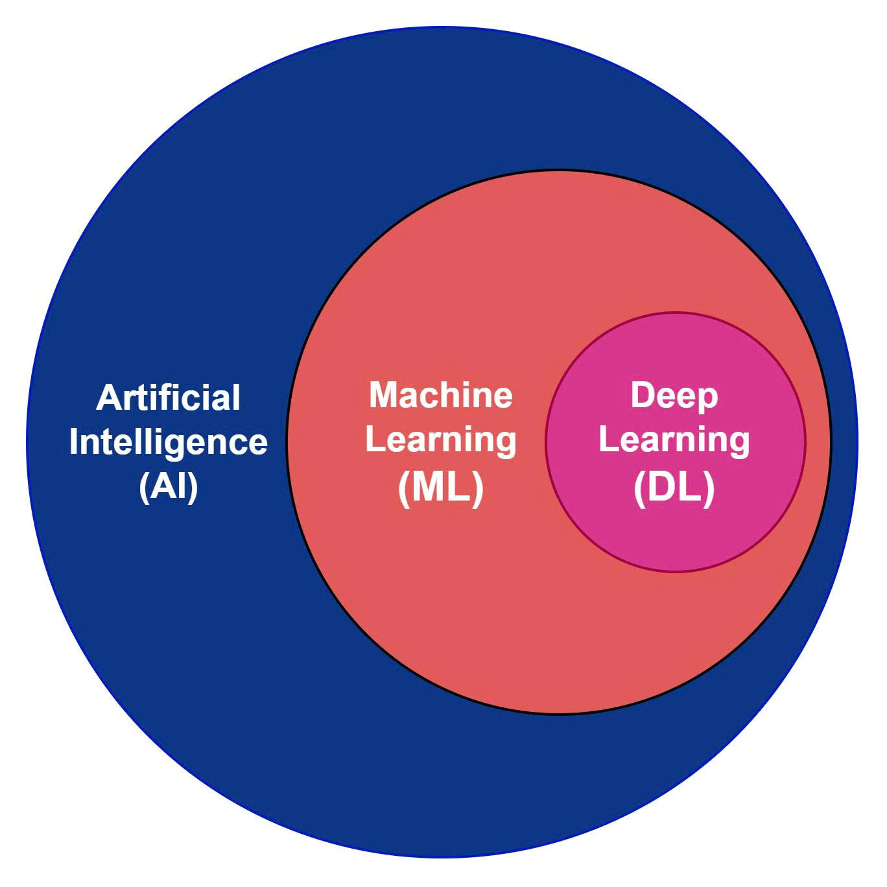
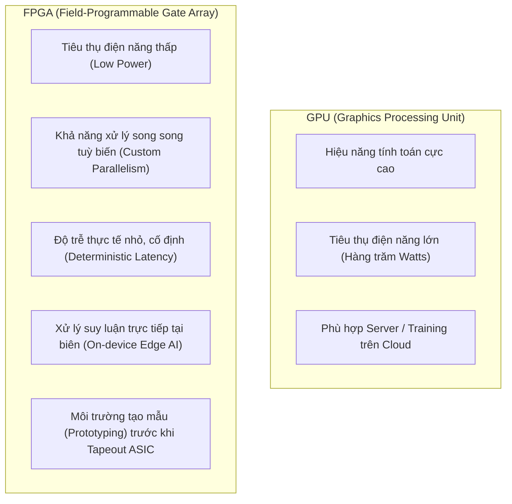
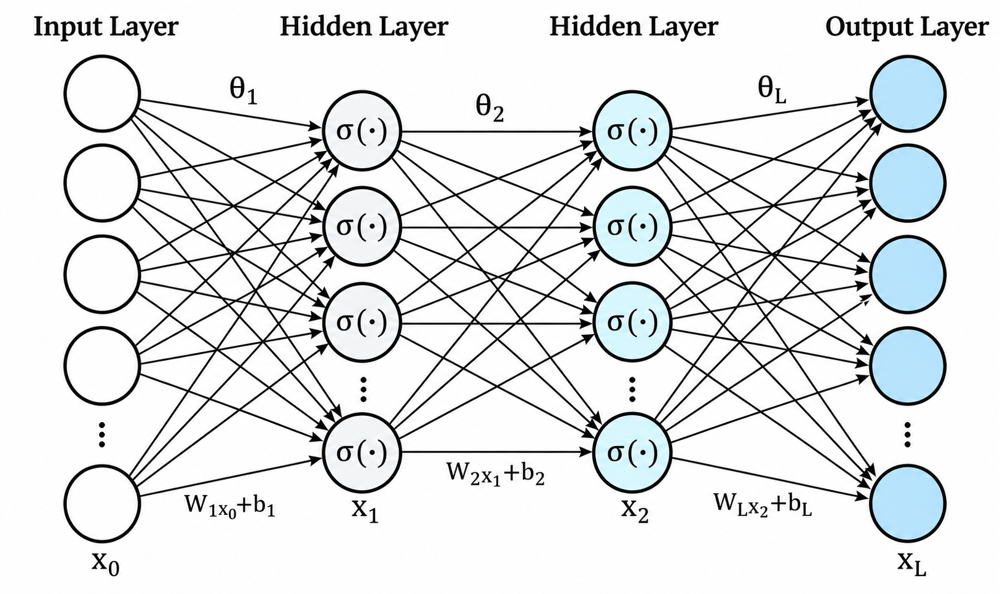
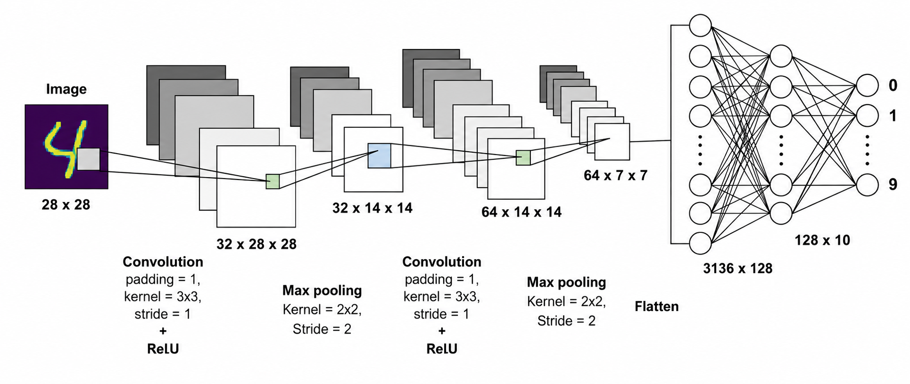

# TÀI LIỆU CHI TIẾT VIDEO 1: TỔNG QUAN VỀ MẠNG NƠ-RON TÍCH CHẬP (CNN) VÀ TĂNG TỐC TRÊN FPGA

Tài liệu này được biên soạn và hệ thống hoá chi tiết dựa trên nội dung bài giảng **Video 1: Introduction to Convolutional Neural Network (CNN)** từ dự án bộ tăng tốc phần cứng CNN nhận dạng chữ số viết tay (MNIST).

---

## MỤC LỤC

1. [Phân cấp Trí tuệ Nhân tạo & Bối cảnh phát triển](#1-phân-cấp-trí-tuệ-nhân-tạo--bối-cảnh-phát-triển)
2. [Tại sao sử dụng FPGA để tăng tốc Deep Learning?](#2-tại-sao-sử-dụng-fpga-để-tăng-tốc-deep-learning)
3. [Mạng nơ-ron nhân tạo truyền thống (Fully Connected Network)](#3-mạng-nơ-ron-nhân-tạo-truyền-thống-fully-connected-network)
4. [Hạn chế của mạng Fully Connected với dữ liệu hình ảnh](#4-hạn-chế-của-mạng-fully-connected-với-dữ-liệu-hình-ảnh)
5. [Mạng nơ-ron tích chập (Convolutional Neural Network - CNN)](#5-mạng-nơ-ron-tích-chập-convolutional-neural-network---cnn)
6. [Chi tiết các lớp và phép toán trong CNN](#6-chi-tiết-các-lớp-và-phép-toán-trong-cnn)
   - [6.1. Phép tích chập (Convolution Process)](#61-phép-tích-chập-convolution-process)
   - [6.2. Lớp đệm (Padding) & Công thức tính kích thước](#62-lớp-đệm-padding--công-thức-tính-kích-thước)
   - [6.3. Độ lệch (Bias) & Hàm kích hoạt (Activation Function - ReLU)](#63-độ-lệch-bias--hàm-kích-hoạt-activation-function---relu)
   - [6.4. Lớp gộp (Pooling Layer: Max Pooling)](#64-lớp-gộp-pooling-layer-max-pooling)
7. [Toàn cảnh kiến trúc CNN & Khái niệm Siêu tham số (Hyperparameters)](#7-toàn-cảnh-kiến-trúc-cnn--khái-niệm-siêu-tham-số-hyperparameters)

---

## 1. Phân cấp Trí tuệ Nhân tạo & Bối cảnh phát triển

Trong bức tranh toàn cảnh về khoa học máy tính, mối quan hệ giữa các lĩnh vực được phân cấp như sau:

<p align="center">
  
</p>

* **Trí tuệ nhân tạo (Artificial Intelligence - AI):** Lĩnh vực rộng lớn nhất, bao gồm việc chế tạo các hệ thống, máy móc có khả năng thực hiện các tác vụ đòi hỏi trí thông minh của con người.
* **Học máy (Machine Learning - ML):** Là tập con của AI, tập trung vào việc xây dựng các thuật toán có khả năng học hỏi từ dữ liệu và tự cải thiện hiệu suất theo thời gian mà không cần phải lập trình cứng (hard-code) tường minh cho từng tác vụ.
* **Học sâu (Deep Learning - DL):** Là tập con chuyên sâu của ML, sử dụng các mạng nơ-ron nhân tạo nhiều tầng (Multi-layer Neural Networks) để mô hình hóa và trích xuất các mẫu biểu diễn phức tạp từ dữ liệu phi cấu trúc (hình ảnh, âm thanh, văn bản).

---

## 2. Tại sao sử dụng FPGA để tăng tốc Deep Learning?

Mặc dù GPU đang thống trị trong việc huấn luyện mô hình, nhưng trong thực tế triển khai ở biên (Edge AI / IoT), phần cứng chuyên biệt như FPGA đóng vai trò then chốt vì các lý do:



### Các bài toán thực tế thúc đẩy việc dùng FPGA:
1. **Tiết kiệm năng lượng (Low Power):** Các thiết bị IoT, thiết bị nhúng chạy pin không thể cấp nguồn cho các GPU lớn.
2. **Băng thông mạng & Độ trễ (Bandwidth & Latency):** Thiết bị IoT truyền thống (như Amazon Echo) phải liên tục gửi dữ liệu âm thanh/hình ảnh lên Server Cloud để phân tích. Điều này làm nghẽn băng thông đường truyền và tăng độ trễ phản hồi.
3. **Bảo mật và Quyền riêng tư (Privacy & Security):** Việc truyền dữ liệu nhạy cảm qua Internet dễ dẫn đến nguy cơ bị nghe lén hoặc rò rỉ dữ liệu. Xử lý suy luận cục bộ (Local Edge Processing) giải quyết triệt để vấn đề này.
4. **Vượt trội so với Vi điều khiển (MCU):** Vi điều khiển xử lý tuần tự nên quá chậm cho các phép tính ma trận của Deep Learning. FPGA cung cấp pipeline phần cứng song song tuỳ biến cao.
5. **Tiền đề chế tạo ASIC (Application-Specific Integrated Circuit):** Trước khi tốn hàng triệu USD để đúc chip ASIC chuyên dụng, FPGA là nền tảng bắt buộc để kiểm thử (emulate) và xác thực thiết kế phần cứng.

---

## 3. Mạng nơ-ron nhân tạo truyền thống (Fully Connected Network)

<p align="center">
  
</p>

Mạng nơ-ron nhân tạo được lấy cảm hứng từ cấu trúc và phương thức hoạt động của các nơ-ron trong não người:

### 3.1. Cấu tạo của một Nơ-ron đơn lẻ (Single Neuron)
Mỗi nơ-ron thực hiện 3 bước tính toán chính:
1. **Phép nhân (Multiplication):** Nhân từng giá trị ngõ vào $x_i$ với trọng số tương ứng $w_i$.
2. **Phép cộng (Addition/Accumulation):** Tính tổng các tích và cộng thêm độ lệch (bias):  $$z = \sum_{i} (x_i \cdot w_i) + b$$
3. **Hàm kích hoạt (Activation Function):** Đưa tổng $z$ qua hàm phi tuyến $f(z)$ để sinh ra ngõ ra $a = f(z)$.

Trọng số ($w$) và độ lệch ($b$) ban đầu được khởi tạo ngẫu nhiên và sẽ được tối ưu dần thông qua quá trình huấn luyện (Training).

### 3.2. Mạng Fully Connected (Toàn liên kết)
* Bao gồm các tầng: **Input Layer** (Tầng vào) $\to$ **Hidden Layers** (Các tầng ẩn) $\to$ **Output Layer** (Tầng ra).
* Gọi là **Fully Connected (FC)** vì *mỗi nơ-ron ở tầng trước đều nối với tất cả các nơ-ron ở tầng kế tiếp*.
* Thuật ngữ "Deep Learning" thường được dùng cho các mạng có từ **2 tầng ẩn trở lên**.

---

## 4. Hạn chế của mạng Fully Connected với dữ liệu hình ảnh

Xét ví dụ phân loại ảnh chữ số viết tay MNIST kích thước $28 \times 28$ pixel ($784$ pixel ngõ vào):

```
Ảnh 28x28 (784 pixel) ──> [Duỗi phẳng 784x1] ──> [Tầng ẩn 128 nơ-ron] ──> [Tầng ra 10 nơ-ron]
```

Mạng Fully Connected gặp 2 nhược điểm nghiêm trọng khi xử lý hình ảnh:

1. **Mất quan hệ không gian (Loss of Spatial Information):**
   * Trong ảnh, các pixel liền kề có mối liên kết hình học chặt chẽ (tạo nên cạnh, góc, đường nét).
   * Mạng FC trải phẳng ảnh thành 1 vector 1D ($784 \times 1$), đối xử mọi pixel độc lập như nhau, làm mất hoàn toàn cấu trúc không gian 2D.
2. **Bùng nổ số lượng tham số (Parameter Explosion):**
   * Với ảnh chỉ $28 \times 28$ ($784$ pixel), nếu nối vào 1 tầng ẩn chỉ $128$ nơ-ron:
     $$\text{Số Weights} = 784 \times 128 \approx 100.352 \text{ tham số (chỉ cho 1 lớp!)}$$
   * Nếu ảnh độ phân giải cao hơn (ví dụ $1080\text{p}$ hay $4\text{K}$), số lượng tham số sẽ lên tới hàng chục, hàng trăm triệu, dẫn đến quá tải bộ nhớ và tính toán.

---

## 5. Mạng nơ-ron tích chập (Convolutional Neural Network - CNN)

<p align="center">
  
</p>

Để giải quyết triệt để các hạn chế trên, kiến trúc **CNN** ra đời và trở thành chuẩn mực cho xử lý ảnh.

### Đặc điểm cốt lõi của CNN:
* **Tận dụng tính tương quan cục bộ (Local Receptive Field):** Quét các kernel (bộ lọc) kích thước nhỏ qua từng vùng ảnh cục bộ.
* **Chia sẻ trọng số (Weight Sharing):** Cùng một kernel được dùng chung trên toàn bộ bức ảnh, giúp giảm hàng nghìn lần số lượng tham số.
* **Kiến trúc phân tầng:**
  1. Các lớp **Convolution & Pooling** ở đầu mạng làm nhiệm vụ trích xuất đặc trưng (Feature Extraction).
  2. Các lớp **Fully Connected** ở cuối mạng làm nhiệm vụ phân loại (Classification).

---

## 6. Chi tiết các lớp và phép toán trong CNN

Một khối Convolution hoàn chỉnh bao gồm các bước:
$$\text{Input} \longrightarrow [\text{Padding}] \longrightarrow [\text{Convolution}] \longrightarrow [\text{Bias Addition}] \longrightarrow [\text{Activation (ReLU)}] \longrightarrow \text{Feature Map}$$

### 6.1. Phép tích chập (Convolution Process)
* Trượt một ma trận bộ lọc (Kernel/Filter, ví dụ $5 \times 5$ hoặc $3 \times 3$) qua ma trận ảnh ngõ vào.
* Tại mỗi vị trí dừng, thực hiện phép nhân từng phần tử (element-wise multiplication) giữa kernel và vùng ảnh tương ứng, sau đó tính tổng tất cả các tích để tạo ra 1 điểm trên **Feature Map** (Bản đồ đặc trưng).

### 6.2. Lớp đệm (Padding) & Công thức tính kích thước
* **Mục đích của Padding:** Thêm các hàng/cột pixel (thường là số 0 - Zero Padding) xung quanh viền ảnh nhằm:
  1. Kiểm soát kích thước không gian (Spatial dimension) của Feature Map ngõ ra.
  2. Đảm bảo các pixel ở góc và cạnh ảnh được kernel quét qua với tần suất tương đương các pixel ở trung tâm, tránh mất mát thông tin biên.

#### Công thức tính kích thước ngõ ra sau Convolution:
$$O = \left\lfloor \frac{W - K + 2P}{S} \right\rfloor + 1$$

Trong đó:
* $W$: Kích thước ngõ vào (Width / Height)
* $K$: Kích thước Kernel (Kernel size)
* $P$: Độ dày lớp đệm (Padding)
* $S$: Bước trượt (Stride)

> **Ví dụ thực tế trong dự án (Conv1):**
> * Ngõ vào: $W = 28$
> * Kernel: $K = 5$
> * Padding: $P = 0$ (Không dùng đệm)
> * Stride: $S = 1$
> $$\text{Kích thước ngõ ra} = \frac{28 - 5 + 2(0)}{1} + 1 = 24 \implies \text{Feature Map } 24 \times 24$$

---

### 6.3. Độ lệch (Bias) & Hàm kích hoạt (Activation Function - ReLU)

1. **Cộng Bias:** Sau khi tính tổng tích chập, một giá trị Bias (tham số có thể học được) sẽ được cộng vào từng giá trị trên Feature Map của kênh tương ứng.
2. **Hàm kích hoạt phi tuyến:** Đưa tính phi tuyến (Non-linearity) vào mạng để mạng có thể học được các mẫu phức tạp.
3. **Hàm ReLU (Rectified Linear Unit):**
   * Là hàm kích hoạt phổ biến và hiệu quả nhất trong CNN.
   * **Định nghĩa toán học:**  $$f(x) = \max(0, x) = \begin{cases} x & \text{nếu } x \ge 0 \\ 0 & \text{nếu } x < 0 \end{cases}$$
   * **Ưu điểm của ReLU:**
     - Giúp mô hình hội tụ nhanh hơn trong quá trình huấn luyện.
     - Tránh hiện tượng triệt tiêu gradient (Vanishing Gradient) như ở hàm Sigmoid/Tanh.
     - Phép toán đơn giản trên phần cứng (trên phần cứng Verilog chỉ là phép kiểm tra bit dấu: nếu âm thì gán bằng 0, không tốn tài nguyên tính toán mũ/chia).

---

### 6.4. Lớp gộp (Pooling Layer: Max Pooling)

Lớp Pooling thực hiện giảm mẫu không gian (Downsampling) cho Feature Map:

```
[Ma trận 4x4] ──(Max Pool 2x2, Stride 2)──> [Ma trận 2x2 (Chọn giá trị cực đại trong mỗi ô 2x2)]
```

* **Phân loại:**
  - **Max Pooling:** Chọn giá trị lớn nhất trong từng cửa sổ $K \times K$ (phổ biến nhất vì giữ lại các đặc trưng nổi bật nhất).
  - **Average Pooling:** Tính giá trị trung bình trong cửa sổ $K \times K$.
* **Mục đích:**
  1. Giảm kích thước dữ liệu và số lượng phép tính cho các tầng phía sau.
  2. Tạo tính bất biến tương đối đối với các phép dịch chuyển nhỏ (Translation Invariance).
  3. Giúp kiểm soát và giảm nguy cơ Overfitting.

#### Công thức tính kích thước sau Pooling:
$$O = \left\lfloor \frac{W - K}{S} \right\rfloor + 1$$

> **Ví dụ thực tế trong dự án (Pool1):**
> * Ngõ vào: $W = 24$
> * Kernel Pooling: $K = 2$
> * Stride: $S = 2$
> $$\text{Kích thước ngõ ra} = \frac{24 - 2}{2} + 1 = 12 \implies \text{Feature Map sau Pool } 12 \times 12$$

---

## 7. Toàn cảnh kiến trúc CNN & Khái niệm Siêu tham số (Hyperparameters)

### 7.1. Cấu trúc tổng thể của mạng CNN trong dự án
1. **Input:** Ảnh $28 \times 28 \times 1$
2. **Conv1 (3 kernels $5\times 5$, Stride 1):** $\to 24 \times 24 \times 3$
3. **MaxPool1 ($2\times 2$, Stride 2) + ReLU:** $\to 12 \times 12 \times 3$
4. **Conv2 (3 kernels $5\times 5$, Stride 1):** $\to 8 \times 8 \times 3$
5. **MaxPool2 ($2\times 2$, Stride 2) + ReLU:** $\to 4 \times 4 \times 3$
6. **Flatten:** $4 \times 4 \times 3 = 48$ phần tử
7. **Fully Connected (48 ngõ vào $\to$ 10 ngõ ra):** $\to 10$ logits
8. **Comparator (ArgMax):** Tìm nhãn chữ số ($0 \dots 9$) có xác suất cao nhất.

### 7.2. Tham số (Parameters) vs Siêu tham số (Hyperparameters)

| Tiêu chí | Tham số (Parameters) | Siêu tham số (Hyperparameters) |
| :--- | :--- | :--- |
| **Định nghĩa** | Các giá trị trọng số ($W$) và độ lệch ($b$) bên trong mô hình. | Các thông số cấu hình kiến trúc và quá trình huấn luyện do con người thiết lập. |
| **Cách xác định** | Mô hình tự động học và cập nhật qua thuật toán tối ưu (Backpropagation/SGD). | Được kỹ sư thiết lập trước khi huấn luyện (dựa trên kinh nghiệm, kiến thức miền, tinh chỉnh thử-sai). |
| **Ví dụ** | $780$ weights, $16$ biases trong mạng MNIST. | Số tầng ẩn, số lượng kernel ($3$), kích thước kernel ($5\times 5$), bước trượt ($S=1$), kích thước Batch ($64$), Tốc độ học (Learning Rate $= 0.01$). |

---

> **Tóm tắt:** Video 1 đã cung cấp nền tảng lý thuyết vững chắc về AI/DL, giải thích lý do tại sao dùng FPGA cho Edge AI, nguyên lý toán học của các tầng Conv, ReLU, Pooling, Fully Connected và công thức tính toán chiều không gian của dữ liệu khi đi qua mạng CNN.
