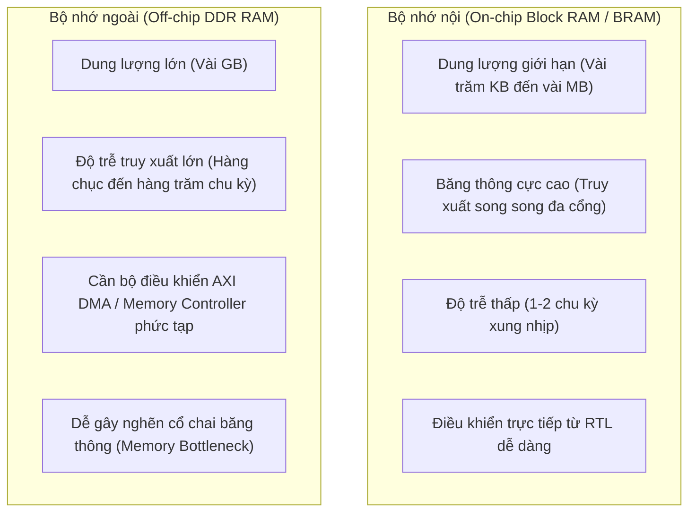
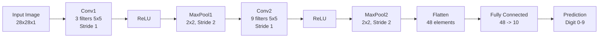

# TÀI LIỆU CHI TIẾT VIDEO 2: THIẾT KẾ KIẾN TRÚC MẠNG CNN TỐI ƯU CHO PHẦN CỨNG FPGA (MNIST DIGIT)

Tài liệu này được biên soạn và hệ thống hoá chi tiết dựa trên nội dung bài giảng **Video 2: CNN Architecture for MNIST Digit** từ dự án bộ tăng tốc phần cứng CNN nhận dạng chữ số viết tay (MNIST).

---

## MỤC LỤC

1. [Ràng buộc tài nguyên bộ nhớ trên FPGA & Bài toán số lượng tham số](#1-ràng-buộc-tài-nguyên-bộ-nhớ-trên-fpga--bài-toán-số-lượng-tham-số)
2. [Góc nhìn kỹ sư FPGA: Tiêu chí lựa chọn mô hình CNN](#2-góc-nhìn-kỹ-sư-fpga-tiêu-chí-lựa-chọn-mô-hình-cnn)
3. [Kiến trúc mạng CNN 796 tham số được lựa chọn](#3-kiến-trúc-mạng-cnn-796-tham-số-được-lựa-chọn)
4. [Phân tích chi tiết luồng xử lý qua từng Layer](#4-phân-tích-chi-tiết-luồng-xử-lý-qua-từng-layer)
   - [4.1. Lớp tích chập thứ nhất (Conv1) & MaxPool1](#41-lớp-tích-chập-thứ-nhất-conv1--maxpool1)
   - [4.2. Lớp tích chập đa kênh thứ hai (Conv2) & MaxPool2](#42-lớp-tích-chập-đa-kênh-thứ-hai-conv2--maxpool2)
   - [4.3. Lớp duỗi phẳng (Flatten) & Toàn liên kết (Fully Connected)](#43-lớp-duỗi-phẳng-flatten--toàn-liên-kết-fully-connected)
5. [Bảng tổng kết chi tiết 796 tham số (Trainable Parameters)](#5-bảng-tổng-kết-chi-tiết-796-tham-số-trainable-parameters)
6. [Đánh giá hiệu năng và độ chính xác](#6-đánh-giá-hiệu-năng-và-độ-chính-xác)

---

## 1. Ràng buộc tài nguyên bộ nhớ trên FPGA & Bài toán số lượng tham số

Khi thiết kế bộ tăng tốc CNN trên FPGA, **số lượng tham số (Weights & Biases)** là yếu tố quyết định tính khả thi và hiệu năng của kiến trúc phần cứng.



### So sánh bộ nhớ nội BRAM vs DDR ngoài:
1. **Bộ nhớ nội (Block RAM / BRAM):**
   - Các chip FPGA (Zynq UltraScale+, Xilinx Artix/Zynq-7000, Gowin GW2A-18C) chỉ có vài Megabits đến vài Megabytes BRAM.
   - Nếu toàn bộ tham số của mô hình nằm gọn trong BRAM, phần cứng có thể đọc trọng số song song tức thời mà không phải chờ đợi.
2. **Bộ nhớ ngoài (DDR SDRAM):**
   - Nếu mô hình quá lớn (hàng triệu tham số), bắt buộc phải lưu trọng số trên DDR ngoài.
   - **Vấn đề phức tạp phát sinh:** Kỹ sư phải thiết kế cơ chế phân đoạn (tiling/caching) để nạp từng phần trọng số từ DDR vào BRAM, quản lý bus AXI DMA và giải quyết độ trễ. Nếu thiết kế không tối ưu, bộ tăng tốc sẽ bị "đói dữ liệu" (stalling) và giảm hiệu năng nghiêm trọng.

> **Mục tiêu thiết kế:** Lựa chọn hoặc thiết kế mô hình CNN có kích thước đủ nhỏ để **lưu trữ toàn bộ tham số trực tiếp trong bộ nhớ nội FPGA (On-chip ROM/BRAM/LUT)**, loại bỏ hoàn toàn sự phụ thuộc vào DDR ngoài trong quá trình suy luận.

---

## 2. Góc nhìn kỹ sư FPGA: Tiêu chí lựa chọn mô hình CNN

Khi tìm kiếm các kiến trúc mô hình CNN trên GitHub hoặc tài liệu nghiên cứu, có rất nhiều biến thể mô hình với số lượng tham số và cấu trúc tầng khác nhau:

```
                  ┌──────────────────────────────────────────────────────────┐
                  │          SO SÁNH CÁC MÔ HÌNH DƯỚI GÓC NHÌN RTL           │
                  └──────────────────────────────────────────────────────────┘
                                        │
           ┌────────────────────────────┴────────────────────────────┐
           ▼                                                         ▼
┌──────────────────────────────────────┐  ┌──────────────────────────────────────┐
│  Mô hình A (~6.000 Tham số)          │  │  Mô hình B (~1.000 Tham số)          │
├──────────────────────────────────────┤  ├──────────────────────────────────────┤
│ • Dùng ít loại layer cơ bản:         │  │ • Dùng nhiều loại layer phức tạp:    │
│   Conv standard, MaxPool, Dense      │  │   Separable Conv, Depthwise, Dropout │
│ • Thiết kế HDL (Verilog) ĐƠN GIẢN    │  │ • Thiết kế HDL CỰC KỲ PHỨC TẠP       │
│ • Tốn nhiều thanh ghi/BRAM hơn       │  │ • Tiết kiệm tham số nhưng tốn công    │
└──────────────────────────────────────┘  └──────────────────────────────────────┘
```

### Nguyên tắc đánh đổi (Trade-off) trong thiết kế phần cứng:
* Thiết kế phần cứng bằng ngôn ngữ mô tả phần cứng thuần (Pure HDL như Verilog/VHDL) là một công việc tốn rất nhiều thời gian và công sức (tedious and time-consuming).
* Một mô hình dù có số tham số ít hơn nhưng nếu sử dụng quá nhiều loại layer "lạ" (như Depthwise Separable Conv, Group Conv, v.v.) sẽ đòi hỏi viết và kiểm thử rất nhiều module RTL riêng biệt.
* Ngược lại, một mô hình có số tham số vừa phải nhưng sử dụng **các layer chuẩn, đồng nhất (Uniform Layers)** sẽ giúp:
  - Tái sử dụng được module phần cứng (ví dụ: dùng chung logic Conv và MaxPool).
  - Rút ngắn thời gian phát triển và đóng gói RTL.
* **Quy tắc vàng:** *Miễn là số lượng tham số nằm vừa vặn trong bộ nhớ FPGA và độ chính xác đạt yêu cầu bài toán (>90%), ưu tiên kiến trúc đơn giản, ít loại layer để tối ưu phần cứng.*

---

## 3. Kiến trúc mạng CNN 796 tham số được lựa chọn

Trong dự án này, mô hình được tối ưu với quy mô **dưới 1000 tham số** (chính xác là **796 tham số**), đảm bảo chạy cực nhẹ và hiệu quả trên FPGA:



---

## 4. Phân tích chi tiết luồng xử lý qua từng Layer

### 4.1. Lớp tích chập thứ nhất (Conv1) & MaxPool1

* **Đầu vào (Input):** Ảnh xám kích thước $28 \times 28 \times 1$ ($784$ pixel, 1 kênh).
* **Bộ lọc (Filters):** 3 filters kích thước $5 \times 5 \times 1$ (bước trượt $S=1$, không đệm $P=0$).
* **Kích thước ngõ ra Conv1:** 
  $$\text{Size} = \frac{28 - 5}{1} + 1 = 24 \implies 24 \times 24 \times 3 \text{ (3 kênh đặc trưng)}$$
* **Cộng Bias:** Mỗi kênh ngõ ra có 1 giá trị bias riêng $\to$ Tổng cộng **3 giá trị bias**.
* **Hàm kích hoạt (Activation):** Áp dụng hàm $\text{ReLU}$ trên từng phần tử của 3 kênh.
* **Lớp gộp (MaxPool1):** Cửa sổ $2 \times 2$, Stride $2$.
  $$\text{Size} = \frac{24 - 2}{2} + 1 = 12 \implies 12 \times 12 \times 3$$

---

### 4.2. Lớp tích chập đa kênh thứ hai (Conv2) & MaxPool2

Khác với Conv1 chỉ có 1 kênh ngõ vào, Conv2 nhận đầu vào là **3 kênh đặc trưng** từ MaxPool1:

```
Kênh vào 1 (12x12) ──[*] Kernel 11 ──┐
Kênh vào 2 (12x12) ──[*] Kernel 12 ──┼──(+) + Bias 1 ──> [Kênh ra 1 (8x8)]
Kênh vào 3 (12x12) ──[*] Kernel 13 ──┘

Kênh vào 1 (12x12) ──[*] Kernel 21 ──┐
Kênh vào 2 (12x12) ──[*] Kernel 22 ──┼──(+) + Bias 2 ──> [Kênh ra 2 (8x8)]
Kênh vào 3 (12x12) ──[*] Kernel 23 ──┘

Kênh vào 1 (12x12) ──[*] Kernel 31 ──┐
Kênh vào 2 (12x12) ──[*] Kernel 32 ──┼──(+) + Bias 3 ──> [Kênh ra 3 (8x8)]
Kênh vào 3 (12x12) ──[*] Kernel 33 ──┘
```

* **Đầu vào:** $12 \times 12 \times 3$ (3 kênh vào).
* **Số lượng bộ lọc:** Để tạo ra 3 kênh ngõ ra từ 3 kênh ngõ vào, cần $3 \times 3 = 9$ bộ lọc kích thước $5 \times 5$:
  $$\text{Tổng số weight Conv2} = 3 \times 3 \times 5 \times 5 = 225 \text{ weights}$$
* **Cơ chế tính toán:** 
  - Mỗi kênh ngõ ra là tổng của 3 phép tích chập từ 3 kênh vào tương ứng với 3 kernel.
  - Sau đó cộng thêm 1 giá trị bias cho mỗi kênh ra ($3$ biases).
* **Kích thước ngõ ra Conv2:** 
  $$\text{Size} = \frac{12 - 5}{1} + 1 = 8 \implies 8 \times 8 \times 3$$
* **Hàm kích hoạt:** $\text{ReLU}$ trên toàn bộ 3 kênh.
* **Lớp gộp (MaxPool2):** Cửa sổ $2 \times 2$, Stride $2$.
  $$\text{Size} = \frac{8 - 2}{2} + 1 = 4 \implies 4 \times 4 \times 3$$

---

### 4.3. Lớp duỗi phẳng (Flatten) & Toàn liên kết (Fully Connected)

* **Lớp Flatten (Trải phẳng):** 
  - Chuyển đổi khối tensor 3D kích thước $4 \times 4 \times 3$ thành vector 1D.
  $$\text{Số phần tử ngõ vào FC} = 4 \times 4 \times 3 = 48 \text{ nơ-ron}$$
* **Lớp Fully Connected (Dense Layer):**
  - Số nơ-ron ngõ vào: $48$
  - Số nơ-ron ngõ ra: $10$ (tương ứng với 10 lớp chữ số từ $0$ đến $9$).
  - Ma trận trọng số (Weights): $48 \times 10 = 480$ trọng số.
  - Độ lệch (Biases): $10$ giá trị bias (1 bias cho mỗi nơ-ron đầu ra).

---

## 5. Bảng tổng kết chi tiết 796 tham số (Trainable Parameters)

Dưới đây là bảng thống kê tường minh từng tham số trong toàn bộ mạng nơ-ron:

| Lớp (Layer) | Cấu hình Tensor | Số lượng Weights | Số lượng Biases | Tổng tham số lớp |
| :--- | :--- | :--- | :--- | :--- |
| **Conv1** | $(3 \text{ out}) \times (1 \text{ in}) \times (5 \times 5)$ | $3 \times 1 \times 25 = 75$ | $3$ | **78** |
| **MaxPool1** | $2 \times 2 \text{ Pooling}$ | $0$ | $0$ | **0** |
| **Conv2** | $(3 \text{ out}) \times (3 \text{ in}) \times (5 \times 5)$ | $3 \times 3 \times 25 = 225$ | $3$ | **228** |
| **MaxPool2** | $2 \times 2 \text{ Pooling}$ | $0$ | $0$ | **0** |
| **FC (Dense)** | $(48 \text{ inputs}) \times (10 \text{ outputs})$ | $48 \times 10 = 480$ | $10$ | **490** |
| **TỔNG CỘNG** | | **780 Weights** | **16 Biases** | **796 Tham số** |

$$\text{Tổng số tham số} = 78 + 228 + 490 = \mathbf{796 \text{ parameters}}$$

---

## 6. Đánh giá hiệu năng và độ chính xác

* **Khả năng chứa trên FPGA:** 
  - $796$ tham số dạng 8-bit (`int8`) chỉ chiếm chưa đầy **800 Bytes**.
  - Dung lượng này hoàn toàn nằm gọn trong vài lát LUT hoặc 1 khối BRAM nhỏ nhất của bất kỳ chip FPGA nào (Zynq-7000, UltraScale+, Gowin GW2A-18C).
* **Độ chính xác (Accuracy):**
  - Mặc dù số tham số siêu nhỏ ($<1000$), mô hình vẫn đạt độ chính xác **$96\%$ trên tập kiểm thử MNIST (Test set)**.
  - Đây là mức cân bằng lý tưởng (sweet spot) giữa hiệu năng nhận dạng và độ phức tạp phần cứng cho các hệ thống nhúng / Edge AI.

---

> **Tóm tắt Video 2:** Video 2 đã làm rõ lý do tại sao phải tối ưu số lượng tham số để phù hợp với bộ nhớ FPGA, phân tích nguyên lý đánh đổi giữa số lượng tham số và số loại layer trong thiết kế RTL, đồng thời giải thích chi tiết cấu trúc toán học của mạng CNN 796 tham số đạt 96% accuracy trên MNIST.
