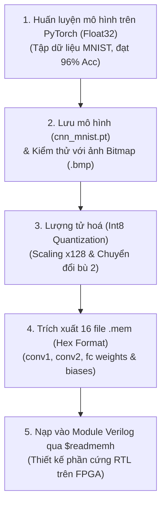

# TÀI LIỆU CHI TIẾT VIDEO 3: PHÁT TRIỂN MÔ HÌNH CNN TRÊN PYTORCH VÀ LƯỢNG TỬ HÓA THAM SỐ CHO PHẦN CỨNG (INT8 QUANTIZATION)

Tài liệu này được biên soạn và hệ thống hoá chi tiết dựa trên nội dung bài giảng **Video 3: CNN Model for MNIST Digit** từ dự án bộ tăng tốc phần cứng CNN nhận dạng chữ số viết tay (MNIST).

---

## MỤC LỤC

1. [Tổng quan quy trình phát triển từ Phần mềm sang Phần cứng](#1-tổng-quan-quy-trình-phát-triển-từ-phần-mềm-sang-phần-cứng)
2. [Cài đặt và Huấn luyện mô hình trên PyTorch (`cnn_mnist.ipynb`)](#2-cài-đặt-và-huấn-luyện-mô-hình-trên-pytorch-cnn_mnistipynb)
   - [2.1. Nạp và tiền xử lý tập dữ liệu MNIST](#21-nạp-và-tiền-xử-lý-tập-dữ-liệu-mnist)
   - [2.2. Định nghĩa kiến trúc lớp `CNN(nn.Module)`](#22-định-nghĩa-kiến-trúc-lớp-cnnnnmodule)
   - [2.3. Vòng lặp huấn luyện (Training Loop) & Đánh giá](#23-vòng-lặp-huấn-luyện-training-loop--đánh-giá)
3. [Kiểm thử mô hình với ảnh Bitmap (.bmp)](#3-kiểm-thử-mô-hình-với-ảnh-bitmap-bmp)
4. [Kỹ thuật lượng tử hóa (Quantization) từ Float32 sang Int8](#4-kỹ-thuật-lượng-tử-hóa-quantization-từ-float32-sang-int8)
   - [4.1. Tại sao phải lượng tử hóa cho FPGA?](#41-tại-sao-phải-lượng-tử-hóa-cho-fpga)
   - [4.2. Nguyên lý nhân tỷ lệ (Scaling Factor = 128)](#42-nguyên-lý-nhân-tỷ-lệ-scaling-factor--128)
   - [4.3. Biểu diễn số bù 2 (Two's Complement) & Xuất mã Hex](#43-biểu-diễn-số-bù-2-twos-complement--xuất-mã-hex)
5. [Cấu trúc 16 file Memory (`.mem`) phục vụ nạp RTL](#5-cấu-trúc-16-file-memory-mem-phục-vụ-nạp-rtl)

---

## 1. Tổng quan quy trình phát triển từ Phần mềm sang Phần cứng

Để xây dựng một bộ tăng tốc AI trên phần cứng FPGA, quy trình chuẩn luôn bắt đầu từ việc xây dựng và kiểm chứng mô hình trên phần mềm trước khi chuyển đổi sang ngôn ngữ phần cứng (HDL):



---

## 2. Cài đặt và Huấn luyện mô hình trên PyTorch (`cnn_mnist.ipynb`)

Mô hình được phát triển trong môi trường Jupyter Notebook sử dụng ngôn ngữ Python và thư viện học sâu **PyTorch** ([`model/cnn_mnist.ipynb`](file:///c:/Gowin/Gowin_V1.9.12_x64/cnn_mnist/model/cnn_mnist.ipynb)).

### 2.1. Nạp và tiền xử lý tập dữ liệu MNIST
* Sử dụng `torchvision.datasets.MNIST` để tự động tải tập dữ liệu về thư mục `./data/`.
* Tập dữ liệu gồm **60.000 ảnh huấn luyện (Train set)** và **10.000 ảnh kiểm thử (Test set)**.
* Chuyển đổi ảnh sang dạng Tensor (`transforms.ToTensor()`), chia thành các mini-batch với `batch_size = 64`.

```python
train_dataset = datasets.MNIST(root='./data/', train=True, transform=transforms.ToTensor(), download=True)
test_dataset = datasets.MNIST(root='./data/', train=False, transform=transforms.ToTensor())

train_loader = torch.utils.data.DataLoader(dataset=train_dataset, batch_size=64, shuffle=True)
test_loader = torch.utils.data.DataLoader(dataset=test_dataset, batch_size=64, shuffle=False)
```

---

### 2.2. Định nghĩa kiến trúc lớp `CNN(nn.Module)`

Lớp mạng CNN được định nghĩa kế thừa từ `torch.nn.Module`:

```python
class CNN(nn.Module):
    def __init__(self):
        super(CNN, self).__init__()
        
        # Mảng numpy phụ trợ dùng để lưu giá trị trung gian phục vụ debug so sánh với phần cứng
        self.conv1_out_np = np.zeros((1, 3, 24, 24))
        self.mp1_out_np   = np.zeros((1, 3, 12, 12))
        self.conv2_out_np = np.zeros((1, 3, 8, 8))
        self.mp2_out_np   = np.zeros((1, 3, 4, 4))
        self.fc_in_np     = np.zeros((1, 48))
        self.fc_out_np    = np.zeros((1, 10))
        
        # 1st Convolution Layer: In (28,28,1) -> Out (24,24,3)
        self.conv1 = nn.Conv2d(in_channels=1, out_channels=3, kernel_size=5)
        
        # 2nd Convolution Layer: In (12,12,3) -> Out (8,8,3)
        self.conv2 = nn.Conv2d(in_channels=3, out_channels=3, kernel_size=5)
        
        # Max Pooling Layer: kernel 2x2, stride 2
        self.mp = nn.MaxPool2d(2)
        
        # Fully Connected Layer: 48 ngõ vào -> 10 ngõ ra
        self.fc_1 = nn.Linear(48, 10)
        
    def forward(self, x):
        in_size = x.size(0)
        
        # Tầng Conv1 + MaxPool1 + ReLU
        x = self.conv1(x)
        self.conv1_out_np = x.detach().numpy()
        x = F.relu(self.mp(x))
        self.mp1_out_np = x.detach().numpy()

        # Tầng Conv2 + MaxPool2 + ReLU
        x = self.conv2(x)
        self.conv2_out_np = x.detach().numpy()
        x = F.relu(self.mp(x))
        self.mp2_out_np = x.detach().numpy()
        
        # Trải phẳng (Flatten) sang vector 1D
        x = x.view(in_size, -1)
        self.fc_in_np = x.detach().numpy()
        
        # Tầng Fully Connected
        x = self.fc_1(x)
        self.fc_out_np = x.detach().numpy()
        
        return F.log_softmax(x, dim=1)
```

> **Lưu ý kỹ thuật quan trọng:** Các biến numpy `self.conv1_out_np`, `self.mp1_out_np`,... được thiết kế chủ đích để trích xuất ma trận dữ liệu sau mỗi tầng tính toán trên phần mềm. Điều này cho phép đối chiếu trực tiếp (cross-check bit-by-bit) với sóng tín hiệu mô phỏng trong testbench Verilog sau này.

---

### 2.3. Vòng lặp huấn luyện (Training Loop) & Đánh giá

* **Bộ tối ưu hoá (Optimizer):** Stochastic Gradient Descent (SGD) với Learning Rate $\eta = 0.01$ và Momentum $= 0.5$.
* **Hàm mất mát (Loss Function):** Negative Log-Likelihood Loss (`F.nll_loss`).
* **Vòng lặp huấn luyện qua 10 Epochs:**
  1. Lan truyền tiến (Feed-forward pass): `output = model(data)`
  2. Tính toán hàm mất mát: `loss = F.nll_loss(output, target)`
  3. Lan truyền ngược (Backpropagation): `loss.backward()`
  4. Cập nhật trọng số: `optimizer.step()`
* **Kết quả:** Sau 10 epochs, mô hình đạt độ chính xác **$96\%$ trên tập kiểm thử (Test Accuracy)**.
* **Lưu mô hình:** Mô hình được lưu ra file `cnn_mnist.pt` để sử dụng suy luận mà không cần huấn luyện lại.

---

## 3. Kiểm thử mô hình với ảnh Bitmap (.bmp)

Sau khi huấn luyện, mô hình được kiểm tra khả năng dự đoán trên từng ảnh bitmap đơn lẻ (ví dụ: file [`model/bmp/train_0.bmp`](file:///c:/Gowin/Gowin_V1.9.12_x64/cnn_mnist/model/bmp/)):

```python
# 1. Đọc ảnh bitmap và chuyển sang numpy array
img = Image.open("./bmp/train_0.bmp", "r")
np_img = np.array(img)

# 2. Reshape về định dạng Tensor (Batch_size, Channels, Height, Width) = (1, 1, 28, 28)
np_img_re = np.reshape(np_img, (1, 1, 28, 28))

# 3. Chuẩn hóa pixel từ [0, 255] về [0.0, 1.0]
data = Variable(torch.tensor((np_img_re / 255.0), dtype=torch.float32))

# 4. Dự đoán qua mô hình và lấy nhãn có xác suất lớn nhất (ArgMax)
output = model(data)
pred = output.data.max(1, keepdim=True)[1]
print('Dự đoán chữ số:', pred.item())
```

---

## 4. Kỹ thuật lượng tử hóa (Quantization) từ Float32 sang Int8

### 4.1. Tại sao phải lượng tử hóa cho FPGA?
* Mô hình PyTorch mặc định lưu trữ trọng số và tính toán bằng định dạng số thực **32-bit Floating Point (`float32`)**.
* Trên phần cứng FPGA:
  - Khối tính toán Floating Point (IEEE 754) tốn rất nhiều tài nguyên Logic (LUTs) và khối nhân cứng (DSP Slices).
  - Độ trễ tính toán lớn, khó tối ưu pipeline xung nhịp cao.
* **Giải pháp:** Chuyển đổi trọng số, độ lệch và dữ liệu trung gian sang định dạng **số nguyên 8-bit (`int8` / Fixed-point)**. Việc này giảm 4 lần dung lượng bộ nhớ và cho phép sử dụng các bộ nhân nguyên cực nhanh trên FPGA.

---

### 4.2. Nguyên lý nhân tỷ lệ (Scaling Factor = 128)

Vì sao lại chọn hệ số nhân là **128**?

* Trong kiểu số nguyên có dấu 8-bit (`signed int8`), khoảng biểu diễn giá trị là từ $[-128, +127]$.
* Cấu trúc 8-bit gồm:
  - **1 bit MSB:** Bit dấu (Sign bit: `0` là dương, `1` là âm).
  - **7 bit còn lại:** Biểu diễn độ lớn ($2^7 = 128$).
* Do đó, nhân giá trị số thực dạng float trong khoảng $[-1.0, +1.0]$ với **$128$** ($2^7$) sẽ ánh xạ chính xác toàn bộ dải giá trị float sang số nguyên 8-bit có dấu mà không bị tràn (Overflow).

$$\text{Weight}_{\text{Int8}} = \text{round}\left(\text{Weight}_{\text{Float32}} \times 128\right)$$

---

### 4.3. Biểu diễn số bù 2 (Two's Complement) & Xuất mã Hex

Trong ngôn ngữ Verilog, lệnh `$readmemh` đọc dữ liệu dưới dạng mã Hex không dấu (Unsigned Hex). Do đó, các số nguyên âm có dấu cần được biểu diễn dưới dạng **số bù 2 (Two's Complement)**:

* Nếu giá trị $x \ge 0$: Giữ nguyên giá trị.
* Nếu giá trị $x < 0$: Cộng thêm $256$ ($2^8$) để đưa về giá trị bù 2 không dấu ($0 \dots 255$).

```python
# Đoạn mã Python chuyển đổi sang bù 2 (Trích từ notebook)
int_conv1_weight_1 = torch.tensor((model.conv1.weight.data[0][0] * 128), dtype=torch.int32)

for i in range(5):
    for j in range(5):
        if int_conv1_weight_1[i][j] < 0:
            int_conv1_weight_1[i][j] += 256  # Ánh xạ số âm sang biểu diễn bù 2 dạng Hex

# Lưu ra file .mem dưới định dạng Hexadecimal 2 chữ số (fmt='%1.2x')
np.savetxt('conv1_weight_1.mem', int_conv1_weight_1, fmt='%1.2x', delimiter=" ")
```

---

## 5. Cấu trúc 16 file Memory (`.mem`) phục vụ nạp RTL

Quá trình trích xuất tạo ra chính xác **16 file `.mem`** chứa toàn bộ $796$ tham số đã lượng tử hóa dưới dạng Hexadecimal:

```
model/ (hoặc rtl_pipelined/rtl/module/)
├── conv1_weight_1.mem     (5x5 = 25 bytes hex - Filter 1 của Conv1)
├── conv1_weight_2.mem     (5x5 = 25 bytes hex - Filter 2 của Conv1)
├── conv1_weight_3.mem     (5x5 = 25 bytes hex - Filter 3 của Conv1)
├── conv1_bias.mem         (3 bytes hex - 3 Biases của Conv1)
│
├── conv2_weight_11.mem    (5x5 = 25 bytes hex - In Channel 1 -> Out Channel 1)
├── conv2_weight_12.mem    (5x5 = 25 bytes hex - In Channel 2 -> Out Channel 1)
├── conv2_weight_13.mem    (5x5 = 25 bytes hex - In Channel 3 -> Out Channel 1)
├── conv2_weight_21.mem    (5x5 = 25 bytes hex - In Channel 1 -> Out Channel 2)
├── conv2_weight_22.mem    (5x5 = 25 bytes hex - In Channel 2 -> Out Channel 2)
├── conv2_weight_23.mem    (5x5 = 25 bytes hex - In Channel 3 -> Out Channel 2)
├── conv2_weight_31.mem    (5x5 = 25 bytes hex - In Channel 1 -> Out Channel 3)
├── conv2_weight_32.mem    (5x5 = 25 bytes hex - In Channel 2 -> Out Channel 3)
├── conv2_weight_33.mem    (5x5 = 25 bytes hex - In Channel 3 -> Out Channel 3)
├── conv2_bias.mem         (3 bytes hex - 3 Biases của Conv2)
│
├── fc_weight.mem          (10x48 = 480 bytes hex - Ma trận trọng số Fully Connected)
└── fc_bias.mem            (10 bytes hex - 10 Biases của Fully Connected)
```

### Cách thức nạp vào Verilog RTL:
Trong các file RTL như [`conv1_calc.v`](file:///c:/Gowin/Gowin_V1.9.12_x64/cnn_mnist/rtl_pipelined/rtl/module/conv1_calc.v), [`conv2_layer.v`](file:///c:/Gowin/Gowin_V1.9.12_x64/cnn_mnist/rtl_pipelined/rtl/module/conv2_layer.v), [`fully_connected.v`](file:///c:/Gowin/Gowin_V1.9.12_x64/cnn_mnist/rtl_pipelined/rtl/module/fully_connected.v), các mảng tham số được nạp tự động khi tổng hợp phần cứng bằng cú pháp:

```verilog
initial begin
    $readmemh("conv1_weight_1.mem", weight_1);
    $readmemh("conv1_weight_2.mem", weight_2);
    $readmemh("conv1_weight_3.mem", weight_3);
    $readmemh("conv1_bias.mem", bias);
end
```

---

> **Tóm tắt Video 3:** Video 3 đã trình bày toàn bộ quy trình xây dựng mô hình CNN trên PyTorch, các kỹ thuật huấn luyện và kiểm thử với ảnh thực tế, nguyên lý lượng tử hóa Int8 bằng hệ số tỷ lệ $128$, và cách thức trích xuất $16$ file memory (`.mem`) định dạng Hex để tích hợp trực tiếp vào phần cứng RTL.
