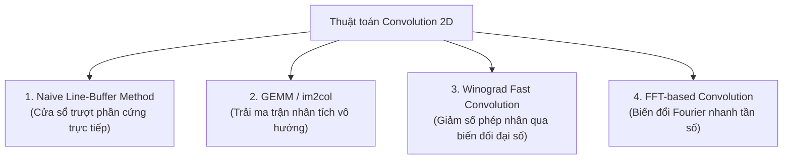

# TÀI LIỆU CHI TIẾT VIDEO 4: THIẾT KẾ PHẦN CỨNG BỘ ĐỆM DÒNG TÍCH CHẬP (CONVOLUTION LINE BUFFER RTL)

Tài liệu này được biên soạn và hệ thống hoá chi tiết dựa trên nội dung bài giảng **Video 4: The RTL Module of Convolution Buffer** từ dự án bộ tăng tốc phần cứng CNN nhận dạng chữ số viết tay (MNIST).

---

## MỤC LỤC

1. [Các phương pháp kiến trúc vi mô (Microarchitecture) cho phép tính Convolution](#1-các-phương-pháp-kiến-trúc-vi-mô-microarchitecture-cho-phép-tính-convolution)
2. [Cơ chế nạp dữ liệu tuần tự theo dòng quét (Raster Scan Streaming)](#2-cơ-chế-nạp-dữ-liệu-tuần-tự-theo-dòng-quét-raster-scan-streaming)
3. [Kiến trúc Bộ đệm dòng (Line Buffer) 140 phần tử](#3-kiến-trúc-bộ-đệm-dòng-line-buffer-140-phần-tử)
   - [3.1. Tại sao chỉ cần đệm 140 phần tử thay vì toàn bộ 784 pixel?](#31-tại-sao-chỉ-cần-đệm-140-phần-tử-thay-vì-toàn-bộ-784-pixel)
   - [3.2. Cấu trúc mảng thanh ghi (Register File)](#32-cấu-trúc-mảng-thanh-ghi-register-file)
4. [Nguyên lý tạo cửa sổ trượt 5x5 song song (Sliding Window Generation)](#4-nguyên-lý-tạo-cửa-sổ-trượt-5x5-song-song-sliding-window-generation)
   - [4.1. Cơ chế xoay vòng 5 trạng thái đệm (`buf_flag`)](#41-cơ-chế-xoay-vòng-5-trạng-thái-đệm-buf_flag)
   - [4.2. Quản lý tọa độ không gian (`w_idx`, `h_idx`) và cờ `valid_out_buf`](#42-quản-lý-tọa-độ-không-gian-w_idx-h_idx-và-cờ-valid_out_buf)
5. [Phân tích mã nguồn Verilog RTL (`conv1_buf.v`)](#5-phân-tích-mã-nguồn-verilog-rtl-conv1_bufv)
6. [Đặc tính dạng sóng mô phỏng (Simulation Timing Waveform)](#6-đặc-tính-dạng-sóng-mô-phỏng-simulation-timing-waveform)

---

## 1. Các phương pháp kiến trúc vi mô (Microarchitecture) cho phép tính Convolution

Khi chuyển đổi một mô hình CNN toán học sang phần cứng phần mềm/RTL, có nhiều kiến trúc vi mô khác nhau để thực hiện phép tích chập:



### So sánh và Lựa chọn:
* **GEMM (im2col):** Hiệu quả trên GPU nhưng trên FPGA đòi hỏi nhân bản dữ liệu gây tốn dung lượng bộ nhớ đệm rất lớn.
* **Winograd / FFT:** Tiết kiệm phép nhân nhưng cấu trúc mạch biến đổi phức tạp, tiêu tốn nhiều tài nguyên logic cộng/trừ và khó kiểm soát sai số lượng tử hóa.
* **Naive Line-Buffer (Phương pháp được chọn trong dự án):**
  - Sử dụng bộ đệm dòng quét trực tiếp (Sliding Window Buffer).
  - Tối ưu tài nguyên cực tốt: không cần lưu trữ toàn bộ ảnh, không cần nhân bản dữ liệu.
  - Phù hợp hoàn hảo với mô hình dòng dữ liệu streaming nối tiếp trên FPGA.

---

## 2. Cơ chế nạp dữ liệu tuần tự theo dòng quét (Raster Scan Streaming)

Ảnh ngõ vào là ảnh xám kích thước $28 \times 28 = 784$ pixel, mỗi pixel là 8-bit unsigned ($0 \dots 255$).

```
Pixel 0    Pixel 1    ...  Pixel 27   ──> Hàng 0
Pixel 28   Pixel 29   ...  Pixel 55   ──> Hàng 1
...
Pixel 756  Pixel 757  ...  Pixel 783  ──> Hàng 27
```

### Đặc điểm của Raster Scan:
1. Dữ liệu được nạp vào bộ tăng tốc **nối tiếp (Serially)**: Mỗi chu kỳ xung nhịp nạp đúng $1$ pixel (`1 pixel / clock cycle`).
2. Quét từ góc trên cùng bên trái $\to$ sang phải $\to$ hết hàng chuyển xuống hàng tiếp theo.
3. **Lợi thế lớn nhất:** 
   - Không cần đợi nạp đủ cả $784$ pixel mới bắt đầu tính toán.
   - Quá trình suy luận được kích hoạt ngay khi nạp đủ $5$ hàng đầu tiên, giúp giảm tối đa độ trễ xử lý (Latency) của toàn hệ thống.

---

## 3. Kiến trúc Bộ đệm dòng (Line Buffer) 140 phần tử

Module [`conv1_buf.v`](file:///c:/Gowin/Gowin_V1.9.12_x64/cnn_mnist/rtl_pipelined/rtl/module/conv1_buf.v) là trái tim của cơ chế sinh cửa sổ trượt trong tầng Conv1.

```
       ┌────────────────────────────────────────────────────────┐
       │   LINE BUFFER 140 BYTES (5 DÒNG x 28 PIXELS/DÒNG)      │
       ├────────────────────────────────────────────────────────┤
Dòng 0 │ buffer[0]   buffer[1]   ... buffer[26]   buffer[27]    │
Dòng 1 │ buffer[28]  buffer[29]  ... buffer[54]   buffer[55]    │
Dòng 2 │ buffer[56]  buffer[57]  ... buffer[82]   buffer[83]    │
Dòng 3 │ buffer[84]  buffer[85]  ... buffer[110]  buffer[111]   │
Dòng 4 │ buffer[112] buffer[113] ... buffer[138]  buffer[139]   │
       └────────────────────────────────────────────────────────┘
```

### 3.1. Tại sao chỉ cần đệm 140 phần tử thay vì toàn bộ 784 pixel?
* Bộ lọc tích chập (Kernel) có kích thước $5 \times 5$. Tại bất kỳ thời điểm nào, phép tích chập chỉ cần truy cập dữ liệu của **5 dòng liên tiếp**.
* Khi cửa sổ trượt quét xong một dòng, dữ liệu pixel của dòng mới tiếp theo sẽ được ghi đè vào vị trí của dòng cũ nhất (đã dùng xong).
* **Hiệu quả tiết kiệm:** Chỉ cần $140$ byte bộ nhớ đệm thay vì $784$ byte ($\approx 82\%$ bộ nhớ đệm được tiết kiệm).

### 3.2. Cấu trúc mảng thanh ghi (Register File)
* Được khai báo trong Verilog dưới dạng mảng thanh ghi 8-bit:
  ```verilog
  reg [DATA_BITS-1:0] buffer [0:WIDTH*FILTER_SIZE-1]; // buffer[0:139]
  ```
* Trên FPGA (Gowin GW2A-18C hoặc Zynq), mảng này được ánh xạ thành **Distributed RAM (LUT-RAM)** hoặc các Flip-Flop nội, cho phép đọc đồng thời 25 vị trí trong cùng 1 chu kỳ xung nhịp mà không bị nghẽn cổng đọc như Block RAM truyền thống.

---

## 4. Nguyên lý tạo cửa sổ trượt 5x5 song song (Sliding Window Generation)

Mỗi chu kỳ xung nhịp khi cờ hợp lệ, bộ đệm xuất ra đồng thời **25 giá trị 8-bit** (`data_out_0` đến `data_out_24`) tạo thành một ma trận $5 \times 5$:

```
┌─────────────┬─────────────┬─────────────┬─────────────┬─────────────┐
│ data_out_0  │ data_out_1  │ data_out_2  │ data_out_3  │ data_out_4  │
├─────────────┼─────────────┼─────────────┼─────────────┼─────────────┤
│ data_out_5  │ data_out_6  │ data_out_7  │ data_out_8  │ data_out_9  │
├─────────────┼─────────────┼─────────────┼─────────────┼─────────────┤
│ data_out_10 │ data_out_11 │ data_out_12 │ data_out_13 │ data_out_14 │
├─────────────┼─────────────┼─────────────┼─────────────┼─────────────┤
│ data_out_15 │ data_out_16 │ data_out_17 │ data_out_18 │ data_out_19 │
├─────────────┼─────────────┼─────────────┼─────────────┼─────────────┤
│ data_out_20 │ data_out_21 │ data_out_22 │ data_out_23 │ data_out_24 │
└─────────────┴─────────────┴─────────────┴─────────────┴─────────────┘
```

---

### 4.1. Cơ chế xoay vòng 5 trạng thái đệm (`buf_flag`)

Do các dòng trong buffer $140$ byte bị ghi đè xoay vòng theo thời gian, thứ tự thực tế của 5 dòng trong bộ đệm thay đổi sau mỗi lần nạp đủ 1 dòng $28$ pixel. Biến `buf_flag` ($0 \dots 4$) điều khiển bộ ghép kênh (Multiplexer) để gán đúng các hàng tương ứng vào ngõ ra:

| Trạng thái `buf_flag` | Dòng tương ứng với Hàng 0 | Hàng 1 | Hàng 2 | Hàng 3 | Hàng 4 |
| :---: | :---: | :---: | :---: | :---: | :---: |
| **`3'd0`** | Dòng 0 (`buffer[0..27]`) | Dòng 1 | Dòng 2 | Dòng 3 | Dòng 4 |
| **`3'd1`** | Dòng 1 (`buffer[28..55]`) | Dòng 2 | Dòng 3 | Dòng 4 | Dòng 0 |
| **`3'd2`** | Dòng 2 (`buffer[56..83]`) | Dòng 3 | Dòng 4 | Dòng 0 | Dòng 1 |
| **`3'd3`** | Dòng 3 (`buffer[84..111]`) | Dòng 4 | Dòng 0 | Dòng 1 | Dòng 2 |
| **`3'd4`** | Dòng 4 (`buffer[112..139]`) | Dòng 0 | Dòng 1 | Dòng 2 | Dòng 3 |

---

### 4.2. Quản lý tọa độ không gian (`w_idx`, `h_idx`) và cờ `valid_out_buf`

* Chiều rộng ảnh $W = 28$, Kernel $K = 5 \implies$ Số vị trí cửa sổ hợp lệ trên 1 dòng là $28 - 5 + 1 = 24$.
* Khi `w_idx` chạy từ $0 \to 23$: Cửa sổ nằm trọn vẹn trong biên ảnh $\to$ `valid_out_buf = 1` (Dữ liệu 5x5 hợp lệ để đưa sang khối nhân cộng tích chập).
* Khi `w_idx` từ $24 \to 27$: Cửa sổ bị tràn ra ngoài viền phải của ảnh $\to$ `valid_out_buf = 0` (Vùng không hợp lệ).
* Khi `w_idx = 27`: Hoàn thành 1 dòng, `w_idx` quay về $0$, `buf_flag` tăng lên $1$, và `h_idx` tăng lên $1$.

---

## 5. Phân tích mã nguồn Verilog RTL (`conv1_buf.v`)

Dưới đây là kiến trúc logic điều khiển cốt lõi trong file [`conv1_buf.v`](file:///c:/Gowin/Gowin_V1.9.12_x64/cnn_mnist/rtl_pipelined/rtl/module/conv1_buf.v):

```verilog
module conv1_buf
    #(
        parameter WIDTH = 28,
                  HEIGHT = 28,
                  DATA_BITS = 8
    )
    (
        input  wire                 clk,
        input  wire                 rst_n,
        input  wire                 valid_in,
        input  wire [DATA_BITS-1:0] data_in,
        output reg  [DATA_BITS-1:0] data_out_0, data_out_1, ..., data_out_24,
        output reg                  valid_out_buf
    );

    localparam FILTER_SIZE = 5;
    reg [DATA_BITS-1:0] buffer [0:WIDTH*FILTER_SIZE-1]; // 140 bytes
    reg [DATA_BITS-1:0] buf_idx;
    reg [4:0]           w_idx, h_idx;
    reg [2:0]           buf_flag; // 0 ~ 4
    reg                 state;

    always @(posedge clk) begin
        if (~rst_n) begin
            // Reset toàn bộ bộ đệm, con trỏ và cờ trạng thái
            buf_idx <= 0; w_idx <= 0; h_idx <= 0;
            buf_flag <= 0; state <= 0; valid_out_buf <= 0;
        end
        else if (valid_in) begin
            // Nạp dữ liệu nối tiếp vào circular buffer 140 bytes
            buf_idx <= (buf_idx == WIDTH*FILTER_SIZE-1) ? 0 : buf_idx + 1;
            buffer[buf_idx] <= data_in;

            // Chờ nạp đủ 140 pixel đầu tiên trước khi kích hoạt đọc
            if (!state) begin
                if (buf_idx == WIDTH*FILTER_SIZE-1) state <= 1'b1;
            end
            else begin
                w_idx <= w_idx + 1'b1;
                
                // Quản lý cờ valid và chuyển dòng
                if (w_idx == WIDTH-FILTER_SIZE+1) begin
                    valid_out_buf <= 1'b0; // Vùng ngoài biên (w_idx = 24)
                end
                else if (w_idx == WIDTH-1) begin
                    buf_flag <= (buf_flag == FILTER_SIZE-1) ? 0 : buf_flag + 1'b1;
                    w_idx <= 0;
                    if (h_idx == HEIGHT-FILTER_SIZE) begin
                        h_idx <= 0;
                        state <= 1'b0; // Hoàn thành 1 bức ảnh 28x28
                    end
                    h_idx <= h_idx + 1'b1;
                end
                else if (w_idx == 0) begin
                    valid_out_buf <= 1'b1; // Bắt đầu vùng hợp lệ của dòng mới
                end

                // Xuất 25 pixel theo trạng thái buf_flag (0 đến 4)
                case (buf_flag)
                    3'd0: begin /* Map dòng 0,1,2,3,4 */ end
                    3'd1: begin /* Map dòng 1,2,3,4,0 */ end
                    3'd2: begin /* Map dòng 2,3,4,0,1 */ end
                    3'd3: begin /* Map dòng 3,4,0,1,2 */ end
                    3'd4: begin /* Map dòng 4,0,1,2,3 */ end
                endcase
            end
        end
    end
endmodule
```

---

## 6. Đặc tính dạng sóng mô phỏng (Simulation Timing Waveform)

Khi mô phỏng testbench ([`rtl_pipelined/rtl/testbench/axis_cnn_mnist_tb.v`](file:///c:/Gowin/Gowin_V1.9.12_x64/cnn_mnist/rtl_pipelined/rtl/testbench/axis_cnn_mnist_tb.v)):

```
clk           : _/‾\_/‾\_/‾\_/‾\_/‾\_/‾\_/‾\_/‾\_/‾\_/‾\_/‾\_/‾\_/‾\_/‾\_/‾\_/‾\_/‾\_/‾\_/‾\_
data_in       : [0][1] ... [139][140][141] ... [163][164] ... [167][168] ... [783]
state         : ________________/‾‾‾‾‾‾‾‾‾‾‾‾‾‾‾‾‾‾‾‾‾‾‾‾‾‾‾‾‾‾‾‾‾‾‾‾‾‾‾‾‾‾‾‾‾‾‾‾‾‾‾
valid_out_buf : ________________/‾‾‾‾‾‾‾‾‾‾‾‾‾‾‾‾‾\_____________/‾‾‾‾‾‾‾‾‾‾‾‾‾‾‾‾‾\__
                |<-- 140 cycles -->|<-- 24 clk -->|<- 4 clk ->|<-- 24 clk -->|
                                    (Hàng 0 ra)    (Vùng biên)  (Hàng 1 ra)
data_out_0..24: ================< Cửa sổ 5x5 #0 >< Cửa sổ 5x5 #1 > ...
```

### Các mốc thời gian quan trọng:
1. **Giai đoạn khởi tạo ($0 \dots 139$ chu kỳ):** Nạp đủ 5 dòng đầu tiên ($140$ pixel). `valid_out_buf = 0`, ngõ ra chưa hợp lệ.
2. **Giai đoạn xuất dòng hợp lệ ($24$ chu kỳ):** `valid_out_buf = 1`. Cửa sổ $5 \times 5$ trượt liên tục xuất $24$ cụm $25$ pixel/chu kỳ sang khối tính tích chập.
3. **Giai đoạn chuyển dòng ($4$ chu kỳ):** `valid_out_buf = 0` tương ứng với $4$ pixel biên cuối dòng.
4. **Tổng số cửa sổ xuất ra:** $24 \text{ hàng} \times 24 \text{ cột} = \mathbf{576 \text{ cửa sổ } 5\times 5}$, khớp chính xác với kích thước Feature Map ngõ ra $24 \times 24$ của tầng Conv1!

---

> **Tóm tắt Video 4:** Video 4 đã phân tích tường minh kiến trúc phần cứng của bộ đệm dòng (Line Buffer 140 phần tử), giải thích cơ chế nạp pixel nối tiếp dạng Raster Scan giúp tối ưu $82\%$ dung lượng bộ nhớ, nguyên lý xoay vòng 5 trạng thái `buf_flag` để xuất ma trận $5 \times 5$ song song trong 1 chu kỳ xung nhịp, và cơ chế phát cờ `valid_out_buf` điều khiển khối tính toán phía sau.
