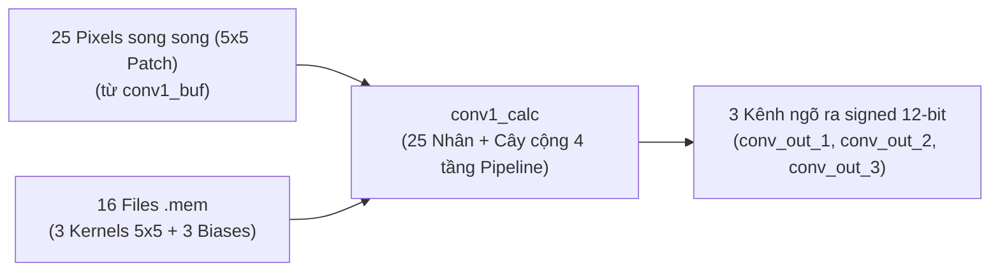
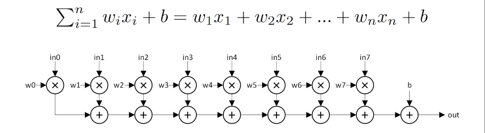
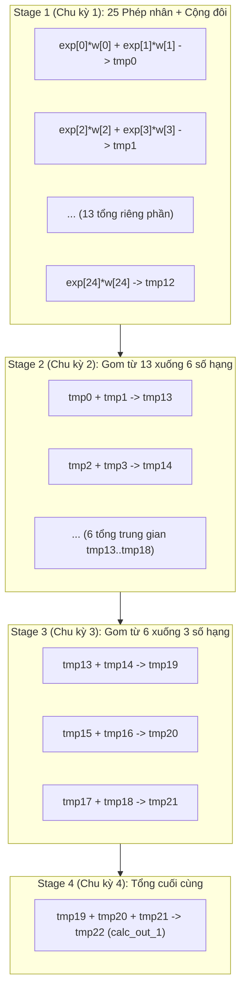

# TÀI LIỆU CHI TIẾT VIDEO 5: THIẾT KẾ PHẦN CỨNG TÍNH TOÁN TÍCH CHẬP VÀ TỐI ƯU PIPELINE (CONVOLUTION CALCULATION RTL)

Tài liệu này được biên soạn và hệ thống hoá chi tiết dựa trên nội dung bài giảng **Video 5: The RTL Module of Convolution Calculation** từ dự án bộ tăng tốc phần cứng CNN nhận dạng chữ số viết tay (MNIST).

---

## MỤC LỤC

1. [Tổng quan khối tính toán tích chập (`conv1_calc.v`)](#1-tổng-quan-khối-tính-toán-tích-chập-conv1_calcv)
2. [Phiên bản mạch tổ hợp thuần (Vanilla Design) & Vấn đề đường trễ tới hạn (Critical Path)](#2-phiên-bản-mạch-tổ-hợp-thuần-vanilla-design--vấn-đề-đường-trễ-tới-hạn-critical-path)
3. [Kỹ thuật Pipelining (Đường ống hóa) tăng tốc tần số xung nhịp](#3-kỹ-thuật-pipelining-đường-ống-hóa-tăng-tốc-tần-số-xung-nhịp)
4. [Kiến trúc cây tính toán 4 tầng Pipeline trong `conv1_calc.v`](#4-kiến-trúc-cây-tính-toán-4-tầng-pipeline-trong-conv1_calcv)
5. [Đồng bộ hóa độ trễ tín hiệu điều khiển (Valid Delay Shift Register)](#5-đồng-bộ-hóa-độ-trễ-tín-hiệu-điều-khiển-valid-delay-shift-register)
6. [Định dạng số học Fixed-point & Cộng Bias](#6-định-dạng-số-học-fixed-point--cộng-bias)
7. [Phân tích dạng sóng mô phỏng (Simulation Timing & Latency)](#7-phân-tích-dạng-sóng-mô-phỏng-simulation-timing--latency)

---

## 1. Tổng quan khối tính toán tích chập (`conv1_calc.v`)

Sau khi bộ đệm dòng ([`conv1_buf.v`](file:///c:/Gowin/Gowin_V1.9.12_x64/cnn_mnist/rtl_pipelined/rtl/module/conv1_buf.v)) trích xuất cửa sổ $5 \times 5$, khối tính toán tích chập ([`conv1_calc.v`](file:///c:/Gowin/Gowin_V1.9.12_x64/cnn_mnist/rtl_pipelined/rtl/module/conv1_calc.v)) tiếp nhận **25 giá trị pixel 8-bit song song** (`data_out_0` đến `data_out_24`) trong mỗi chu kỳ xung nhịp.



### Nhiệm vụ toán học của module:
1. Tính tích vô hướng (Dot Product) giữa 25 pixel ngõ vào với 25 trọng số (Weights) của bộ lọc:
   $$\text{Sum} = \sum_{i=0}^{24} \left(\text{Pixel}_i \times \text{Weight}_i\right)$$
2. Thực hiện song song cho cả **3 bộ lọc** (tương ứng 3 kênh ngõ ra).
3. Chia tỷ lệ cố định (Fixed-point Scaling) và cộng giá trị Bias tương ứng của từng kênh.

---

## 2. Phiên bản mạch tổ hợp thuần (Vanilla Design) & Vấn đề đường trễ tới hạn (Critical Path)

<p align="center">
  
</p>

Trong thư mục [`rtl_vanilla/`](file:///c:/Gowin/Gowin_V1.9.12_x64/cnn_mnist/rtl_vanilla/rtl/module/conv1_calc.v), phép tính được triển khai bằng mạch tổ hợp thuần (Pure Combinational Circuit):

```verilog
// Phiên bản Vanilla (Tổ hợp thuần trong 1 chu kỳ)
assign calc_out_1 = exp_data[0]*weight_1[0] + exp_data[1]*weight_1[1] + ... + exp_data[24]*weight_1[24];
assign conv_out_1 = calc_out_1[19:8] + exp_bias[0];
```

```
[exp_data * weight] ──> [Bộ nhân 25 phần tử] ──> [Cây cộng 25 ngõ vào] ──> [Cộng Bias] ──> Ngõ ra
|<──────────────────────────── ĐƯỜNG TRỄ TỚI HẠN (CRITICAL PATH) LỚN ────────────────────────────>|
```

### Hạn chế nghiêm trọng của thiết kế tổ hợp thuần:
* **Thời gian lan truyền lớn (Large Propagation Delay):** Tín hiệu phải đi qua 25 bộ nhân, sau đó qua nhiều tầng bộ cộng liên tiếp trước khi đến ngõ ra trong cùng 1 chu kỳ xung nhịp.
* **Đường trễ tới hạn (Critical Path):** Là chuỗi lan truyền dài nhất từ đầu vào đến đầu ra. Độ dài đường trễ này quyết định tần số xung nhịp tối đa ($F_{\max}$) của chip.
* **Giảm hiệu năng hệ thống:** Thiết kế Vanilla khiến $F_{\max}$ bị giới hạn ở mức rất thấp (thường $<40\text{ MHz} - 50\text{ MHz}$ trên FPGA), không thể đạt hiệu năng cao.

---

## 3. Kỹ thuật Pipelining (Đường ống hóa) tăng tốc tần số xung nhịp

Để giải quyết vấn đề đường trễ tới hạn, phiên bản tối ưu [`rtl_pipelined/`](file:///c:/Gowin/Gowin_V1.9.12_x64/cnn_mnist/rtl_pipelined/rtl/module/conv1_calc.v) áp dụng kỹ thuật **Pipelining**:

```
[25 Phép nhân] ──[Reg Stage 1]──> [Cộng tầng 1] ──[Reg Stage 2]──> [Cộng tầng 2] ──[Reg Stage 3]──> [Cộng tầng 3] ──[Reg Stage 4]──> Ngõ ra
|<── Chu kỳ 1 ──>|<── Chu kỳ 2 ──>|<── Chu kỳ 3 ──>|<── Chu kỳ 4 ──>|
```

* **Nguyên lý:** Chèn các tầng thanh ghi Flip-Flop (Pipeline Registers) để cắt cây tính toán dài thành **4 chặng ngắn độc lập**.
* **Lợi ích:** Mỗi chặng chỉ gồm một phép toán rất nhỏ, thời gian lan truyền giảm mạnh $\to$ Tần số xung nhịp $F_{\max}$ dễ dàng đạt **$>100\text{ MHz} - 150\text{ MHz}$** trên FPGA (Gowin GW2A-18C hoặc Zynq).

---

## 4. Kiến trúc cây tính toán 4 tầng Pipeline trong `conv1_calc.v`

Cây cộng Pipelined Adder Tree trong [`conv1_calc.v`](file:///c:/Gowin/Gowin_V1.9.12_x64/cnn_mnist/rtl_pipelined/rtl/module/conv1_calc.v) được chia làm 4 giai đoạn cụ thể:



### Chi tiết 4 Stage trong mã Verilog:
1. **Stage 1 (Chu kỳ 1 - 13 thanh ghi):**
   Thực hiện đồng thời 25 phép nhân và gom thành 13 tổng riêng phần:
   ```verilog
   calc_out_1_tmp0  <= exp_data[0]*weight_1[0]   + exp_data[1]*weight_1[1];
   calc_out_1_tmp1  <= exp_data[2]*weight_1[2]   + exp_data[3]*weight_1[3];
   // ...
   calc_out_1_tmp11 <= exp_data[22]*weight_1[22] + exp_data[23]*weight_1[23];
   calc_out_1_tmp12 <= exp_data[24]*weight_1[24];
   ```
2. **Stage 2 (Chu kỳ 2 - 6 thanh ghi):**
   Cộng từng cặp từ 13 số hạng xuống 6 số hạng (`tmp13` $\dots$ `tmp18`):
   ```verilog
   calc_out_1_tmp13 <= calc_out_1_tmp0 + calc_out_1_tmp1;
   calc_out_1_tmp14 <= calc_out_1_tmp2 + calc_out_1_tmp3;
   // ...
   calc_out_1_tmp18 <= calc_out_1_tmp10 + calc_out_1_tmp11 + calc_out_1_tmp12;
   ```
3. **Stage 3 (Chu kỳ 3 - 3 thanh ghi):**
   Cộng tiếp tục xuống 3 số hạng (`tmp19`, `tmp20`, `tmp21`):
   ```verilog
   calc_out_1_tmp19 <= calc_out_1_tmp13 + calc_out_1_tmp14;
   calc_out_1_tmp20 <= calc_out_1_tmp15 + calc_out_1_tmp16;
   calc_out_1_tmp21 <= calc_out_1_tmp17 + calc_out_1_tmp18;
   ```
4. **Stage 4 (Chu kỳ 4 - 1 thanh ghi):**
   Cộng 3 số hạng cuối cùng để có kết quả tổng tích chập 20-bit:
   ```verilog
   calc_out_1_tmp22 <= calc_out_1_tmp19 + calc_out_1_tmp20 + calc_out_1_tmp21;
   assign calc_out_1 = calc_out_1_tmp22;
   ```

---

## 5. Đồng bộ hóa độ trễ tín hiệu điều khiển (Valid Delay Shift Register)

Do luồng dữ liệu tính toán bị trễ **4 chu kỳ xung nhịp** khi đi qua 4 tầng thanh ghi, tín hiệu điều khiển `valid_out_buf` (từ module Buffer) phải được làm trễ tương ứng đúng 4 chu kỳ để đồng bộ chính xác với dữ liệu ngõ ra.

```verilog
reg valid_out_buf_tmp0, valid_out_buf_tmp1, valid_out_buf_tmp2, valid_out_buf_tmp3;

always @(posedge clk) begin
    if (~rst_n) begin
        valid_out_buf_tmp0 <= 0;
        valid_out_buf_tmp1 <= 0;
        valid_out_buf_tmp2 <= 0;
        valid_out_buf_tmp3 <= 0;
    end else begin
        valid_out_buf_tmp0 <= valid_out_buf;       // Trễ 1 chu kỳ
        valid_out_buf_tmp1 <= valid_out_buf_tmp0;  // Trễ 2 chu kỳ
        valid_out_buf_tmp2 <= valid_out_buf_tmp1;  // Trễ 3 chu kỳ
        valid_out_buf_tmp3 <= valid_out_buf_tmp2;  // Trễ 4 chu kỳ
    end
end

assign valid_out_calc = valid_out_buf_tmp3; // Đồng bộ hoàn hảo với ngõ ra sau Stage 4
```

---

## 6. Định dạng số học Fixed-point & Cộng Bias

Sau khi tính được tổng 20-bit `calc_out_1`, kết quả được chuẩn hóa lại về dải số có dấu 12-bit:

```verilog
// Trích xuất bit [19:8] (tương đương phép chia cho 256 / dịch phải 8 bit) và cộng Bias
assign conv_out_1 = calc_out_1[19:8] + exp_bias[0];
assign conv_out_2 = calc_out_2[19:8] + exp_bias[1];
assign conv_out_3 = calc_out_3[19:8] + exp_bias[2];
```

* **Phép dịch phải 8 bit (`calc_out[19:8]`):** Do cả Pixel và Weight đều là định dạng số nguyên đã nhân tỷ lệ, phép nhân 2 số nguyên 8-bit tạo ra 16 bit độ lớn. Trích xuất bit `[19:8]` đóng vai trò chia $256$, đưa dữ liệu về đúng tỷ lệ Fixed-point ban đầu.
* **Mở rộng dấu Bias (`exp_bias`):** Giá trị bias 8-bit được mở rộng dấu (Sign-extension) lên 12-bit để cộng an toàn với `calc_out[19:8]`:
  ```verilog
  assign exp_bias[0] = (bias[0][7] == 1) ? {4'b1111, bias[0]} : {4'd0, bias[0]};
  ```

---

## 7. Phân tích dạng sóng mô phỏng (Simulation Timing & Latency)

Khi chạy mô phỏng trong Vivado hoặc Gowin EDA:

```
clk            : _/‾\_/‾\_/‾\_/‾\_/‾\_/‾\_/‾\_/‾\_/‾\_/‾\_/‾\_/‾\_
valid_out_buf  : ___/‾‾‾‾‾‾‾‾‾‾‾‾‾‾‾‾‾‾‾‾‾‾‾‾\____________________
data_out_0..24 : ===< Cửa sổ #0 >< Cửa sổ #1 > ...
                 |  Stage 1  |  Stage 2  |  Stage 3  |  Stage 4  |
valid_out_calc : ________________________/‾‾‾‾‾‾‾‾‾‾‾‾‾‾‾‾‾‾‾‾‾‾‾‾\
                 |<--- Latency = 4 chu kỳ --->|
conv_out_1..3  : ========================< Kết quả #0 >< Kết quả #1 >
```

* **Độ trễ tính toán (Latency):** Chính xác **4 chu kỳ xung nhịp** kể từ khi cửa sổ $5 \times 5$ đầu tiên đi vào.
* **Băng thông xử lý (Throughput):** Sau khi nạp đầy pipeline, module xuất ra **1 kết quả tích chập hoàn chỉnh trên mỗi chu kỳ xung nhịp** (`1 result / clock cycle`), không có bế tắc (No Stall).
* **Kích thước ngõ ra:** Tạo ra đúng $24 \times 24 = 576$ điểm dữ liệu cho mỗi kênh, tổng cộng $3$ kênh đặc trưng $24 \times 24 \times 3$.

---

> **Tóm tắt Video 5:** Video 5 đã phân tích sự khác biệt cốt lõi giữa mạch tổ hợp thuần (Vanilla) và mạch đường ống (Pipelined), chứng minh lý do tại sao cây tính toán 4 tầng Pipeline giúp rút ngắn Critical Path và tăng vọt tần số xung nhịp trên FPGA, đồng thời giải thích cơ chế dịch trễ tín hiệu Valid và định dạng số học Fixed-point trong `conv1_calc.v`.
