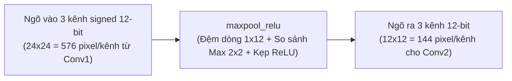
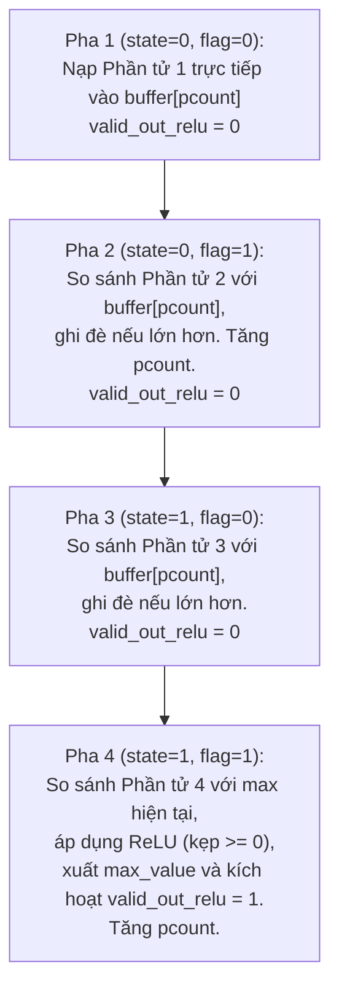

# TÀI LIỆU CHI TIẾT VIDEO 6: THIẾT KẾ PHẦN CỨNG LỚP GỘP MAX POOLING VÀ HÀM KÍCH HOẠT RELU (MAXPOOL & RELU RTL)

Tài liệu này được biên soạn và hệ thống hoá chi tiết dựa trên nội dung bài giảng **Video 6: The RTL Module of Max Pooling and ReLU** từ dự án bộ tăng tốc phần cứng CNN nhận dạng chữ số viết tay (MNIST).

---

## MỤC LỤC

1. [Tổng quan khối Max Pooling & ReLU (`maxpool_relu.v`)](#1-tổng-quan-khối-max-pooling--relu-maxpool_reluv)
2. [Nguyên lý toán học của phép Max Pooling 2x2 kết hợp ReLU](#2-nguyên-lý-toán-học-của-phép-max-pooling-2x2-kết-hợp-relu)
3. [Thiết kế bộ đệm dòng siêu tối ưu 12 phần tử (Line Buffer 1x12)](#3-thiết-kế-bộ-đệm-dòng-siêu-tối-ưu-12-phần-tử-line-buffer-1x12)
4. [Cơ chế máy trạng thái 4 pha xử lý cửa sổ 2x2](#4-cơ-chế-máy-trạng-thái-4-pha-xử-lý-cửa-sổ-2x2)
   - [4.1. Vai trò của các cờ điều khiển (`state`, `flag`, `pcount`)](#41-vai-trò-của-các-cờ-điều-khiển-state-flag-pcount)
   - [4.2. Chi tiết luồng tính toán qua 4 pha](#42-chi-tiết-luồng-tính-toán-qua-4-pha)
5. [Tính tái sử dụng cao qua Parameterization (Dùng cho cả Layer 1 và Layer 2)](#5-tính-tái-sử-dụng-cao-qua-parameterization-dùng-cho-cả-layer-1-và-layer-2)
6. [Phân tích mã nguồn Verilog RTL (`maxpool_relu.v`)](#6-phân-tích-mã-nguồn-verilog-rtl-maxpool_reluv)
7. [Đặc tính dạng sóng mô phỏng (Simulation Timing & Waveform)](#7-đặc-tính-dạng-sóng-mô-phỏng-simulation-timing--waveform)

---

## 1. Tổng quan khối Max Pooling & ReLU (`maxpool_relu.v`)

Module [`maxpool_relu.v`](file:///c:/Gowin/Gowin_V1.9.12_x64/cnn_mnist/rtl_pipelined/rtl/module/maxpool_relu.v) đảm nhận hai chức năng liên tiếp trong kiến trúc CNN:
1. **Max Pooling ($2 \times 2$, Stride 2):** Giảm kích thước không gian của Feature Map xuống một nửa theo cả chiều rộng và chiều cao.
2. **Hàm kích hoạt ReLU:** Loại bỏ các giá trị âm (gán về 0) để duy trì tính phi tuyến của mạng.



---

## 2. Nguyên lý toán học của phép Max Pooling 2x2 kết hợp ReLU

Trong mỗi ô cửa sổ trượt $2 \times 2$ gồm 4 phần tử liền kề:

```
┌───────────┬───────────┐
│ Phần tử 1 │ Phần tử 2 │  ──> Nằm trên Hàng 1 (Dòng lẻ)
├───────────┼───────────┤
│ Phần tử 3 │ Phần tử 4 │  ──> Nằm trên Hàng 2 (Dòng chẵn)
└───────────┴───────────┘
```

1. **Tìm giá trị cực đại (Max Pooling):**
   $$M = \max(\text{Phần tử 1}, \text{Phần tử 2}, \text{Phần tử 3}, \text{Phần tử 4})$$
2. **Kẹp giá trị phi tuyến (ReLU Function):**
   $$\text{Output} = \max(0, M) = \begin{cases} M & \text{nếu } M > 0 \\ 0 & \text{nếu } M \le 0 \end{cases}$$

---

## 3. Thiết kế bộ đệm dòng siêu tối ưu 12 phần tử (Line Buffer 1x12)

Đối với Feature Map ngõ vào kích thước $24 \times 24$ ($576$ giá trị/kênh):
* Nếu thiết kế thông thường: Cần đệm cả 2 hàng ($2 \times 24 = 48$ phần tử) hoặc lưu toàn bộ ảnh.
* **Kỹ thuật tối ưu trong thiết kế này:** Chỉ sử dụng **bộ đệm 1 hàng rút gọn gồm 12 phần tử (`buffer1[0:11]`)** cho mỗi kênh!

```
               BỘ ĐỆM 12 PHẦN TỬ CHO MỖI KÊNH (1x12 REGISTERS)
┌──────────┬──────────┬──────────┬──────────┬─────┬───────────┐
│ buffer[0]│ buffer[1]│ buffer[2]│ buffer[3]│ ... │ buffer[11]│
└──────────┴──────────┴──────────┴──────────┴─────┴───────────┘
```

### Tại sao chỉ cần 12 phần tử?
* Khi hàng thứ nhất đi vào: Cặp 2 phần tử liên tiếp (Phần tử 1 và Phần tử 2) được so sánh ngay lập tức, và **chỉ giá trị lớn nhất tạm thời** giữa 2 phần tử này được ghi vào `buffer[pcount]` ($pcount = 0 \dots 11$).
* Do đó, 24 pixel của hàng thứ nhất được nén ngay thành 12 giá trị max trung gian.
* Khi hàng thứ hai đi vào: Phần tử 3 và 4 được so sánh tiếp tục với giá trị trong buffer và xuất kết quả ra ngoài ngay lập tức, sau đó ô nhớ sẵn sàng cho cặp dòng tiếp theo!

---

## 4. Cơ chế máy trạng thái 4 pha xử lý cửa sổ 2x2

### 4.1. Vai trò của các cờ điều khiển (`state`, `flag`, `pcount`)

* **`flag` (1-bit):** Điều khiển vị trí phần tử theo chiều ngang (cột).
  - `flag = 0`: Phần tử bên trái (Cột lẻ).
  - `flag = 1`: Phần tử bên phải (Cột chẵn).
* **`state` (1-bit):** Điều khiển vị trí phần tử theo chiều dọc (hàng).
  - `state = 0`: Đang xử lý dòng trên (Hàng 1 của ô 2x2).
  - `state = 1`: Đang xử lý dòng dưới (Hàng 2 của ô 2x2).
* **`pcount` (4-bit, $0 \dots 11$):** Con trỏ chỉ số cột trong bộ đệm 12 phần tử.

---

### 4.2. Chi tiết luồng tính toán qua 4 pha

Mỗi ô $2 \times 2$ được xử lý tuần tự qua 4 chu kỳ xung nhịp:



1. **Pha 1 (`state = 0, flag = 0` - Phần tử 1):**
   Ghi trực tiếp giá trị vào bộ đệm:
   ```verilog
   buffer1[pcount] <= conv_out_1;
   valid_out_relu  <= 0;
   ```
2. **Pha 2 (`state = 0, flag = 1` - Phần tử 2):**
   So sánh phần tử 2 với giá trị trong bộ đệm, giữ lại giá trị lớn hơn:
   ```verilog
   if (buffer1[pcount] < conv_out_1)
       buffer1[pcount] <= conv_out_1;
   valid_out_relu <= 0;
   ```
3. **Pha 3 (`state = 1, flag = 0` - Phần tử 3):**
   So sánh phần tử 3 (ở hàng dưới) với giá trị max trung gian trong bộ đệm:
   ```verilog
   if (buffer1[pcount] < conv_out_1)
       buffer1[pcount] <= conv_out_1;
   valid_out_relu <= 0;
   ```
4. **Pha 4 (`state = 1, flag = 1` - Phần tử 4 & ReLU):**
   So sánh phần tử 4 với giá trị lớn nhất của 3 phần tử trước, sau đó qua cổng ReLU:
   ```verilog
   valid_out_relu <= 1; // Kích hoạt cờ ngõ ra hợp lệ
   if (buffer1[pcount] < conv_out_1)
       max_value_1 <= (conv_out_1 > 0) ? conv_out_1 : 12'd0;
   else
       max_value_1 <= (buffer1[pcount] > 0) ? buffer1[pcount] : 12'd0;
   ```

---

## 5. Tính tái sử dụng cao qua Parameterization (Dùng cho cả Layer 1 và Layer 2)

Module [`maxpool_relu.v`](file:///c:/Gowin/Gowin_V1.9.12_x64/cnn_mnist/rtl_pipelined/rtl/module/maxpool_relu.v) được thiết kế dạng tổng quát hóa với các tham số `parameter`:

```verilog
module maxpool_relu
    #(
        parameter CONV_BIT        = 12, // Độ rộng bit dữ liệu
                  HALF_WIDTH      = 12, // Chiều rộng ngõ ra sau Pooling
                  HALF_HEIGHT     = 12, // Chiều cao ngõ ra sau Pooling
                  HALF_WIDTH_BIT  = 4   // Số bit biểu diễn con trỏ pcount
    )
```

Nhờ thiết kế tham số hóa, cùng một file Verilog này được tái sử dụng nguyên vẹn ở cả 2 tầng trong mạng:

| Vị trí sử dụng | Kích thước ngõ vào | Kích thước ngõ ra | Cấu hình tham số Module |
| :--- | :---: | :---: | :--- |
| **`maxpool_relu_1`** (Sau Conv1) | $24 \times 24 \times 3$ | $12 \times 12 \times 3$ | `HALF_WIDTH = 12, HALF_HEIGHT = 12, HALF_WIDTH_BIT = 4` |
| **`maxpool_relu_2`** (Sau Conv2) | $8 \times 8 \times 3$ | $4 \times 4 \times 3$ | `HALF_WIDTH = 4, HALF_HEIGHT = 4, HALF_WIDTH_BIT = 3` |

---

## 6. Phân tích mã nguồn Verilog RTL (`maxpool_relu.v`)

```verilog
module maxpool_relu
    #(
        parameter CONV_BIT = 12,
                  HALF_WIDTH = 12,
                  HALF_HEIGHT = 12,
                  HALF_WIDTH_BIT = 4
    )
    (
        input  wire                       clk,
        input  wire                       rst_n,
        input  wire                       valid_in,
        input  wire signed [CONV_BIT-1:0] conv_out_1, conv_out_2, conv_out_3,
        output reg  [CONV_BIT-1:0]        max_value_1, max_value_2, max_value_3,
        output reg                        valid_out_relu
    );

    reg signed [CONV_BIT-1:0] buffer1 [0:HALF_WIDTH-1];
    reg signed [CONV_BIT-1:0] buffer2 [0:HALF_WIDTH-1];
    reg signed [CONV_BIT-1:0] buffer3 [0:HALF_WIDTH-1];

    reg [HALF_WIDTH_BIT-1:0] pcount;
    reg state, flag;

    always @(posedge clk) begin
        if (~rst_n) begin
            pcount <= 0; state <= 0; flag <= 0;
            valid_out_relu <= 0;
            max_value_1 <= 0; max_value_2 <= 0; max_value_3 <= 0;
        end
        else if (valid_in) begin
            flag <= ~flag;
            if (flag == 1) begin
                pcount <= (pcount == HALF_WIDTH-1) ? 0 : pcount + 1;
                if (pcount == HALF_WIDTH-1) state <= ~state;
            end

            if (state == 0) begin
                valid_out_relu <= 0;
                if (flag == 0) buffer1[pcount] <= conv_out_1;
                else if (buffer1[pcount] < conv_out_1) buffer1[pcount] <= conv_out_1;
            end
            else begin
                if (flag == 0) begin
                    valid_out_relu <= 0;
                    if (buffer1[pcount] < conv_out_1) buffer1[pcount] <= conv_out_1;
                end
                else begin
                    valid_out_relu <= 1; // Xuất kết quả tại Pha 4
                    if (buffer1[pcount] < conv_out_1)
                        max_value_1 <= (conv_out_1 > 0) ? conv_out_1 : 0;
                    else
                        max_value_1 <= (buffer1[pcount] > 0) ? buffer1[pcount] : 0;
                end
            end
        end
        else valid_out_relu <= 0;
    end
endmodule
```

---

## 7. Đặc tính dạng sóng mô phỏng (Simulation Timing & Waveform)

```
clk            : _/‾\_/‾\_/‾\_/‾\_/‾\_/‾\_/‾\_/‾\_/‾\_/‾\_/‾\_/‾\_/‾\_/‾\_
valid_in       : ‾‾‾‾‾‾‾‾‾‾‾‾‾‾‾‾‾‾‾‾‾‾‾‾‾‾‾‾‾‾‾‾‾‾‾‾‾‾‾‾‾‾‾‾‾‾‾‾‾‾‾‾‾‾‾‾
flag           : _/‾\_/‾\_/‾\_/‾\_/‾\_/‾\_/‾\_/‾\_/‾\_/‾\_/‾\_/‾\_/‾\_/‾\_
state          : _______________________________/‾‾‾‾‾‾‾‾‾‾‾‾‾‾‾‾‾‾‾‾‾‾‾
                 |<------- Hàng 1 (24 clk) ---->|<------- Hàng 2 (24 clk) ---->|
valid_out_relu : _______________________________/\_/\_/\_/\_/\_/\_/\_/\_/\_/\_/\_
                                                (Xuất 12 xung tại các Pha 4)
max_value_1..3 : ===============================< Out 0 >< Out 1 > ... < Out 11 >
```

* **Thông lượng ngõ ra:** 
  - Với mỗi khối $2 \times 2$ pixel ngõ vào ($4$ chu kỳ xung nhịp `valid_in`), module phát đúng **1 xung `valid_out_relu`** ở chu kỳ thứ 4 kèm theo giá trị max đã kích hoạt ReLU.
* **Tổng số điểm ảnh ngõ ra:** 
  - Ở tầng 1: $\frac{24 \times 24}{4} = \mathbf{144 \text{ giá trị/kênh}}$ (tương ứng ma trận $12 \times 12$).
  - Ở tầng 2: $\frac{8 \times 8}{4} = \mathbf{16 \text{ giá trị/kênh}}$ (tương ứng ma trận $4 \times 4$).

---

> **Tóm tắt Video 6:** Video 6 đã phân tích chi tiết module Max Pooling kết hợp ReLU, giải thích kỹ thuật đệm dòng siêu tiết kiệm (chỉ cần 12 thanh ghi cho hàng 24 pixel), cơ chế máy trạng thái 4 pha xử lý gọn gàng ô $2 \times 2$ trên luồng streaming, và khả năng tái sử dụng module cho cả 2 tầng Pooling trong kiến trúc CNN.
