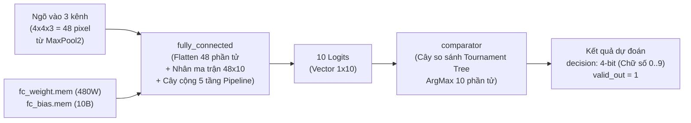
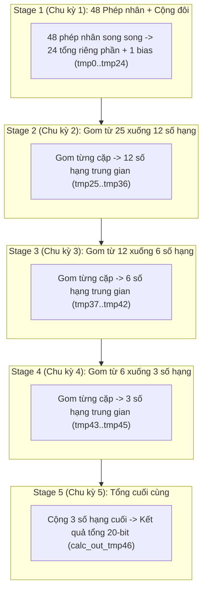

# TÀI LIỆU CHI TIẾT VIDEO 7: THIẾT KẾ PHẦN CỨNG TẦNG TOÀN LIÊN KẾT (FULLY CONNECTED) VÀ BỘ SO SÁNH QUYẾT ĐỊNH (COMPARATOR RTL)

Tài liệu này được biên soạn và hệ thống hoá chi tiết dựa trên nội dung bài giảng **Video 7: The RTL Module of Fully Connected** từ dự án bộ tăng tốc phần cứng CNN nhận dạng chữ số viết tay (MNIST).

---

## MỤC LỤC

1. [Tổng quan tầng Fully Connected và Bộ so sánh quyết định](#1-tổng-quan-tầng-fully-connected-và-bộ-so-sánh-quyết-định)
2. [Cơ chế duỗi phẳng (Flatten) và nạp bộ đệm 48 phần tử](#2-cơ-chế-duỗi-phẳng-flatten-và-nạp-bộ-đệm-48-phần-tử)
3. [Kiến trúc tính toán Fully Connected 5 tầng Pipeline (`fully_connected.v`)](#3-kiến-trúc-tính-toán-fully-connected-5-tầng-pipeline-fully_connectedv)
   - [3.1. Phép nhân ma trận - vector và bài toán Critical Path](#31-phép-nhân-ma-trận---vector-và-bài-toán-critical-path)
   - [3.2. Chi tiết 5 tầng Pipeline (Pipelined Adder Tree)](#32-chi-tiết-5-tầng-pipeline-pipelined-adder-tree)
   - [3.3. Đồng bộ hóa độ trễ tín hiệu điều khiển (5-cycle Latency Matching)](#33-đồng-bộ-hóa-độ-trễ-tín-hiệu-điều-khiển-5-cycle-latency-matching)
4. [Module Bộ so sánh ra quyết định phân loại (`comparator.v`)](#4-module-bộ-so-sánh-ra-quyết-định-phân-loại-comparatorv)
   - [4.1. Thuật toán tìm cực đại dạng Cây thi đấu (Tournament Tree)](#41-thuật-toán-tìm-cực-đại-dạng-cây-thi-đấu-tournament-tree)
   - [4.2. Khối giải mã nhãn chữ số (ArgMax Decoder)](#42-khối-giải-mã-nhãn-chữ-số-argmax-decoder)
5. [Phân tích mã nguồn Verilog RTL (`fully_connected.v` & `comparator.v`)](#5-phân-tích-mã-nguồn-verilog-rtl-fully_connectedv--comparatorv)
6. [Dạng sóng mô phỏng và Kết quả nhận dạng cuối cùng](#6-dạng-sóng-mô-phỏng-và-kết-quả-nhận-dạng-cuối-cùng)

---

## 1. Tổng quan tầng Fully Connected và Bộ so sánh quyết định

Sau khi đi qua tầng tích chập và gộp thứ hai (Conv2 + MaxPool2), Feature Map ngõ ra có kích thước $4 \times 4 \times 3$ ($48$ điểm dữ liệu). Giai đoạn cuối cùng của bộ tăng tốc bao gồm 2 khối phần cứng nối tiếp:



---

## 2. Cơ chế duỗi phẳng (Flatten) và nạp bộ đệm 48 phần tử

* **Dữ liệu ngõ vào:** Nhận đồng thời 3 luồng dữ liệu song song 12-bit từ 3 kênh (`data_in_1`, `data_in_2`, `data_in_3`), mỗi kênh phát ra một chuỗi $1 \times 16$ giá trị ($4 \times 4 = 16$ pixel).
* **Cơ chế nạp song song vào bộ đệm 48 phần tử (`buffer[0:47]`):**
  - Con trỏ `buf_idx` ($0 \dots 15$) tăng dần mỗi chu kỳ để ghi đồng thời 3 phần tử vào 3 dải địa chỉ tương ứng:
    - Kênh 1: `buffer[buf_idx] <= data1;` (Lưu tại ô $0 \dots 15$)
    - Kênh 2: `buffer[16 + buf_idx] <= data2;` (Lưu tại ô $16 \dots 31$)
    - Kênh 3: `buffer[32 + buf_idx] <= data3;` (Lưu tại ô $32 \dots 47$)
  - Sau đúng **16 chu kỳ xung nhịp**, toàn bộ 48 phần tử được nạp đầy vào bộ đệm và cờ `state` chuyển sang `1` để bắt đầu tính toán.

---

## 3. Kiến trúc tính toán Fully Connected 5 tầng Pipeline (`fully_connected.v`)

### 3.1. Phép nhân ma trận - vector và bài toán Critical Path

Tầng Fully Connected thực hiện phép tính cho 10 nơ-ron ngõ ra:
$$y_k = \sum_{i=0}^{47} \left(\text{Input}_i \times \text{Weight}_{k, i}\right) + \text{Bias}_k \quad (k = 0 \dots 9)$$

* **Tổng số tham số:** $48 \times 10 = 480$ trọng số và $10$ giá trị bias (tổng cộng $490$ tham số).
* **Cơ chế tính toán tuần tự 10 nơ-ron:** Sử dụng biến đếm `out_idx` ($0 \dots 9$). Tại mỗi bước `out_idx`, module tính toán tích vô hướng của 48 phần tử ngõ vào với 48 trọng số của nơ-ron thứ `out_idx`.
* **Vấn đề Critical Path:** Việc nhân 48 phần tử và cộng dồn 48 tích + bias trong 1 chu kỳ duy nhất (phiên bản Vanilla) tạo ra đường trễ cực lớn. Do đó, thiết kế pipelined chia cây cộng thành **5 tầng thanh ghi**.

---

### 3.2. Chi tiết 5 tầng Pipeline (Pipelined Adder Tree)



1. **Stage 1 (Chu kỳ 1 - 25 thanh ghi):** Thực hiện 48 phép nhân song song, gom thành 24 cặp cộng và nạp thêm giá trị bias:
   ```verilog
   calc_out_tmp0  <= weight[out_idx*48 + 0] * buffer[0] + weight[out_idx*48 + 1] * buffer[1];
   // ...
   calc_out_tmp23 <= weight[out_idx*48 + 46] * buffer[46] + weight[out_idx*48 + 47] * buffer[47];
   calc_out_tmp24 <= bias[out_idx]; // Nạp bias
   ```
2. **Stage 2 (Chu kỳ 2 - 12 thanh ghi):** Gom 25 số hạng xuống 12 số hạng (`tmp25` $\dots$ `tmp36`).
3. **Stage 3 (Chu kỳ 3 - 6 thanh ghi):** Gom 12 số hạng xuống 6 số hạng (`tmp37` $\dots$ `tmp42`).
4. **Stage 4 (Chu kỳ 4 - 3 thanh ghi):** Gom 6 số hạng xuống 3 số hạng (`tmp43` $\dots$ `tmp45`).
5. **Stage 5 (Chu kỳ 5 - 1 thanh ghi):** Cộng 3 số hạng cuối cùng để có kết quả tổng 20-bit `calc_out_tmp46`.

---

### 3.3. Đồng bộ hóa độ trễ tín hiệu điều khiển (5-cycle Latency Matching)

Tương ứng với 5 tầng thanh ghi dữ liệu, tín hiệu `valid_out_fc_tmp0` được đưa qua thanh ghi dịch 5 tầng:

```verilog
always @(posedge clk) begin
    if (~rst_n) begin
        valid_out_fc_tmp1 <= 0; valid_out_fc_tmp2 <= 0;
        valid_out_fc_tmp3 <= 0; valid_out_fc_tmp4 <= 0;
        valid_out_fc_tmp5 <= 0;
    end else begin
        valid_out_fc_tmp1 <= valid_out_fc_tmp0;
        valid_out_fc_tmp2 <= valid_out_fc_tmp1;
        valid_out_fc_tmp3 <= valid_out_fc_tmp2;
        valid_out_fc_tmp4 <= valid_out_fc_tmp3;
        valid_out_fc_tmp5 <= valid_out_fc_tmp4;
    end
end
assign valid_out_fc = valid_out_fc_tmp5; // Độ trễ đúng 5 chu kỳ
assign data_out = calc_out[18:7];        // Dịch phải 7 bit (Fixed-point scaling)
```

---

## 4. Module Bộ so sánh ra quyết định phân loại (`comparator.v`)

Module [`comparator.v`](file:///c:/Gowin/Gowin_V1.9.12_x64/cnn_mnist/rtl_pipelined/rtl/module/comparator.v) thực hiện thuật toán **ArgMax** (tìm chỉ số của nơ-ron có giá trị logit lớn nhất trong 10 nơ-ron đầu ra):

### 4.1. Thuật toán tìm cực đại dạng Cây thi đấu (Tournament Tree)

Mô hình chia để trị (Divide and Conquer) so sánh song song 10 phần tử qua 4 tầng thi đấu:

```
Tầng 1 (5 cặp):
  cmp1_0 = max(buffer[0], buffer[1])
  cmp1_1 = max(buffer[2], buffer[3])
  cmp1_2 = max(buffer[4], buffer[5])
  cmp1_3 = max(buffer[6], buffer[7])
  cmp1_4 = max(buffer[8], buffer[9])

Tầng 2 (3 nhánh):
  cmp2_0 = max(cmp1_0, cmp1_1)
  cmp2_1 = max(cmp1_2, cmp1_3)
  cmp2_2 = cmp1_4

Tầng 3 (2 nhánh):
  cmp3_0 = max(cmp2_0, cmp2_1)
  cmp3_1 = cmp2_2

Tầng 4 (Chung kết):
  max    = max(cmp3_0, cmp3_1)
```

---

### 4.2. Khối giải mã nhãn chữ số (ArgMax Decoder)

Sau khi xác định được giá trị cực đại `max`, mạch so khớp giá trị này với từng vị trí trong `buffer[0..9]` để gán nhãn dự đoán:

```verilog
if      (max == buffer[0]) decision <= 4'd0;
else if (max == buffer[1]) decision <= 4'd1;
else if (max == buffer[2]) decision <= 4'd2;
else if (max == buffer[3]) decision <= 4'd3;
else if (max == buffer[4]) decision <= 4'd4;
else if (max == buffer[5]) decision <= 4'd5;
else if (max == buffer[6]) decision <= 4'd6;
else if (max == buffer[7]) decision <= 4'd7;
else if (max == buffer[8]) decision <= 4'd8;
else if (max == buffer[9]) decision <= 4'd9;
```

---

## 5. Phân tích mã nguồn Verilog RTL (`fully_connected.v` & `comparator.v`)

### 5.1. Nạp trọng số và đệm trong `fully_connected.v`:
```verilog
initial begin
    $readmemh("fc_weight.mem", weight); // 480 bytes hex
    $readmemh("fc_bias.mem", bias);     // 10 bytes hex
end
```

### 5.2. Quản lý trạng thái và chốt kết quả trong `comparator.v`:
```verilog
always @(posedge clk) begin
    if (~rst_n) begin
        valid_out <= 0; buf_idx <= 0; delay_cnt <= 0; state <= 0; decision <= 0;
    end else if (valid_in) begin
        buffer[buf_idx] <= data_in; // Nạp lần lượt 10 giá trị ngõ ra từ FC
        buf_idx <= buf_idx + 1'b1;
        if (buf_idx == 9) state <= 1;
    end else if (state == 1) begin
        delay_cnt <= delay_cnt + 1'b1;
        if (delay_cnt == 12'd5) valid_out <= 1; // Xuất xung hoàn thành
        else valid_out <= 0;

        // Thực thi cây so sánh Tournament Tree & Giải mã decision
    end
end
```

---

## 6. Dạng sóng mô phỏng và Kết quả nhận dạng cuối cùng

```
clk            : _/‾\_/‾\_/‾\_/‾\_/‾\_/‾\_/‾\_/‾\_/‾\_/‾\_/‾\_/‾\_/‾\_/‾\_/‾\_/‾\_
valid_in (FC)  : ‾‾‾‾‾‾‾‾‾‾‾‾‾‾‾‾\_______________________________________________
                 |<-- 16 clk --->| (Nạp đủ 48 pixel)
valid_out_fc   : ______________________/\_/\_/\_/\_/\_/\_/\_/\_/\_/\_____________
                 |<-- 5 clk trễ ->|(Xuất 10 logit tương ứng 10 nơ-ron)
valid_in (CMP) : ______________________/\_/\_/\_/\_/\_/\_/\_/\_/\_/\_____________
valid_out (CMP): ___________________________________________________________/‾\_
decision [3:0] : ===========================================================< 5 >
```

### Tổng kết thời gian thực thi (Execution Time Summary):
* **Thời gian nạp Flatten:** $16$ chu kỳ xung nhịp.
* **Thời gian tính 10 nơ-ron FC:** $10$ chu kỳ (+ $5$ chu kỳ trễ pipeline).
* **Thời gian so sánh ArgMax:** $\approx 5$ chu kỳ xung nhịp.
* **Kết quả cuối cùng:** Tín hiệu `valid_out = 1` kích hoạt cờ báo hoàn thành, ngõ ra `decision[3:0]` mang giá trị chữ số dự đoán chính xác (từ $0$ đến $9$).

---

> **Tóm tắt Video 7:** Video 7 đã hoàn thiện 2 module cuối cùng của bộ tăng tốc CNN: Module Fully Connected với cây cộng 5 tầng Pipeline (tính toán 480 weights + 10 biases) và Module Comparator sử dụng cây so sánh Tournament Tree dạng chia để trị để tìm cực đại và xuất nhãn chữ số 4-bit với độ chính xác cao.
