# TÀI LIỆU CHI TIẾT VIDEO 8: TÍCH HỢP TOÀN DIỆN CÁC TẦNG MẠNG VÀ MÔ PHỎNG HỆ THỐNG CNN ACCELERATOR (CNN LAYERS INTEGRATION)

Tài liệu này được biên soạn và hệ thống hoá chi tiết dựa trên nội dung bài giảng **Video 8: CNN Layers Integration** từ dự án bộ tăng tốc phần cứng CNN nhận dạng chữ số viết tay (MNIST).

---

## MỤC LỤC

1. [Sơ đồ khối tổng thể tích hợp hệ thống (System Architecture)](#1-sơ-đồ-khối-tổng-thể-tích-hợp-hệ-thống-system-architecture)
2. [Chi tiết kết nối các tầng phần cứng](#2-chi-tiết-kết-nối-các-tầng-phần-cứng)
   - [2.1. Tầng tích chập và gộp 1 (`conv1_layer` + `maxpool_relu_1`)](#21-tầng-tích-chập-và-gộp-1-conv1_layer--maxpool_relu_1)
   - [2.2. Tầng tích chập và gộp 2 (`conv2_layer` + `maxpool_relu_2`)](#22-tầng-tích-chập-và-gộp-2-conv2_layer--maxpool_relu_2)
   - [2.3. Tầng phân loại và so sánh (`fully_connected` + `comparator`)](#23-tầng-phân-loại-và-so-sánh-fully_connected--comparator)
3. [Phân tích chi tiết tầng Conv2 đa kênh (`conv2_layer.v`)](#3-phân-tích-chi-tiết-tầng-conv2-đa-kênh-conv2_layerv)
4. [Xây dựng môi trường kiểm thử Testbench (`top_tb.v`)](#4-xây-dựng-môi-trường-kiểm-thử-testbench-top_tbv)
5. [Kết quả mô phỏng dạng sóng (Simulation Verification)](#5-kết-quả-mô-phỏng-dạng-sóng-simulation-verification)
6. [Đánh giá tổng kết & Bước chuẩn bị triển khai lên Tang Primer 20K](#6-đánh-giá-tổng-kết--bước-chuẩn-bị-triển-khai-lên-tang-primer-20k)

---

## 1. Sơ đồ khối tổng thể tích hợp hệ thống (System Architecture)

Trong Video 8, toàn bộ các khối phần cứng được phát triển độc lập từ Video 4 đến Video 7 được liên kết phân cấp (Hierarchical Integration) thành một hệ thống tăng tốc CNN hoàn chỉnh:

```mermaid
flowchart LR
    In["Pixel Stream\n(784 cycles)\n8-bit unsigned"] --> L1["conv1_layer\n(conv1_buf +\nconv1_calc)"]
    L1 --"24x24x3\nvalid_out_1"--> MP1["maxpool_relu_1\n(HALF_WIDTH=12)"]
    MP1 --"12x12x3\nvalid_out_2"--> L2["conv2_layer\n(3 conv2_buf +\n3 conv2_calc)"]
    L2 --"8x8x3\nvalid_out_3"--> MP2["maxpool_relu_2\n(HALF_WIDTH=4)"]
    MP2 --"4x4x3 (48)\nvalid_out_4"--> FC["fully_connected\n(5-Stage Pipeline\n480W + 10B)"]
    FC --"10 Logits\nvalid_out_5"--> CMP["comparator\n(Tournament Tree\nArgMax)"]
    CMP --> Out["decision: [3:0]\n(Digit 0..9)\nvalid_out_6 = 1"]
```



---

## 2. Chi tiết kết nối các tầng phần cứng

### 2.1. Tầng tích chập và gộp 1 (`conv1_layer` + `maxpool_relu_1`)
* Module [`conv1_layer.v`](file:///c:/Gowin/Gowin_V1.9.12_x64/cnn_mnist/rtl_pipelined/rtl/module/conv1_layer.v) đóng gói bên trong:
  - `conv1_buf`: Đệm 140 byte, xuất 25 pixel song song.
  - `conv1_calc`: Cây nhân cộng 4 tầng pipeline, tạo ra 3 kênh ngõ ra `conv_out_1..3` (kích thước $24 \times 24 \times 3$).
* Kết nối trực tiếp sang `maxpool_relu_1` với tham số `HALF_WIDTH = 12` để giảm kích thước xuống $12 \times 12 \times 3$.

---

### 2.2. Tầng tích chập và gộp 2 (`conv2_layer` + `maxpool_relu_2`)
* Module [`conv2_layer.v`](file:///c:/Gowin/Gowin_V1.9.12_x64/cnn_mnist/rtl_pipelined/rtl/module/conv2_layer.v) tiếp nhận ngõ vào $12 \times 12 \times 3$ từ `maxpool_relu_1`.
* Thực hiện phép tích chập đa kênh (3 kênh vào $\to$ 3 kênh ra) sử dụng 9 bộ kernel $5 \times 5$, cho ra Feature Map $8 \times 8 \times 3$.
* Kết nối sang `maxpool_relu_2` với tham số `HALF_WIDTH = 4` để giảm mẫu xuống $4 \times 4 \times 3$ ($48$ điểm dữ liệu).

---

### 2.3. Tầng phân loại và so sánh (`fully_connected` + `comparator`)
* Module [`fully_connected.v`](file:///c:/Gowin/Gowin_V1.9.12_x64/cnn_mnist/rtl_pipelined/rtl/module/fully_connected.v) nạp 48 phần tử và thực hiện nhân ma trận $48 \times 10$ qua 5 tầng pipeline $\to$ Xuất 10 logit ngõ ra.
* Module [`comparator.v`](file:///c:/Gowin/Gowin_V1.9.12_x64/cnn_mnist/rtl_pipelined/rtl/module/comparator.v) tìm cực đại theo cây Tournament Tree và xuất nhãn dự đoán `decision` (4-bit) kèm cờ hoàn thành `valid_out`.

---

## 3. Phân tích chi tiết tầng Conv2 đa kênh (`conv2_layer.v`)

Tầng Conv2 là khối phức tạp nhất về mặt định tuyến dữ liệu vì phải xử lý đồng thời 3 kênh ngõ vào để sinh ra 3 kênh ngõ ra:

```
┌────────────────────────────────────────────────────────────────────────┐
│                        CẤU TRÚC BÊN TRONG CONV2_LAYER                  │
├────────────────────────────────────────────────────────────────────────┤
│                                                                        │
│ Kênh 1 vào ──> [conv2_buf_1 (60B)] ──> 25 pixels ─┐                    │
│ Kênh 2 vào ──> [conv2_buf_2 (60B)] ──> 25 pixels ─┼──> [conv2_calc_1]  │──> Kênh 1 ra (8x8)
│ Kênh 3 vào ──> [conv2_buf_3 (60B)] ──> 25 pixels ─┘  (w11, w12, w13)  │
│                                                   │                    │
│                                                   ├──> [conv2_calc_2]  │──> Kênh 2 ra (8x8)
│                                                   │  (w21, w22, w23)  │
│                                                   │                    │
│                                                   └──> [conv2_calc_3]  │──> Kênh 3 ra (8x8)
│                                                      (w31, w32, w33)  │
└────────────────────────────────────────────────────────────────────────┘
```

### Điểm khác biệt cốt lõi giữa Conv1 và Conv2:

| Tiêu chí so sánh | Tầng 1 (`conv1_layer`) | Tầng 2 (`conv2_layer`) |
| :--- | :--- | :--- |
| **Kích thước ngõ vào** | $28 \times 28 \times 1$ (1 kênh vào) | $12 \times 12 \times 3$ (3 kênh vào) |
| **Bộ đệm dòng (Line Buffer)** | 1 buffer $140$ bytes ($5 \times 28$) | 3 buffer, mỗi buffer $60$ phần tử ($5 \times 12$) |
| **Khối tính toán (Calc Blocks)** | 1 module tính toán chung | 3 module tính toán song song (`conv2_calc_1..3`) |
| **Số lượng ngõ vào mỗi khối Calc** | $25$ pixel ($1 \times 25$) | $75$ pixel ($3 \times 25$ từ 3 buffer) |
| **Số bộ lọc (Kernels)** | 3 kernels ($3 \times 1 \times 5 \times 5 = 75$ weights) | 9 kernels ($3 \times 3 \times 5 \times 5 = 225$ weights) |
| **Kích thước Feature Map ra** | $24 \times 24 \times 3$ | $8 \times 8 \times 3$ |

---

## 4. Xây dựng môi trường kiểm thử Testbench (`top_tb.v`)

Trong file [`rtl_pipelined/rtl/testbench/top_tb.v`](file:///c:/Gowin/Gowin_V1.9.12_x64/cnn_mnist/rtl_pipelined/rtl/testbench/top_tb.v):

1. **Khởi tạo xung nhịp (Clock Generator):** Chu kỳ $10\text{ ns}$ tương ứng tần số hoạt động **$100\text{ MHz}$**:
   ```verilog
   always #5 clk = ~clk;
   ```
2. **Nạp ảnh kiểm thử mẫu (Testvector):** Nạp ảnh chữ số **3** (file [`rtl_pipelined/rtl/testvector/3_0.txt`](file:///c:/Gowin/Gowin_V1.9.12_x64/cnn_mnist/rtl_pipelined/rtl/testvector/3_0.txt)) chứa 784 giá trị hex:
   ```verilog
   initial begin
       $readmemh("../../../../rtl/testvector/3_0.txt", pixels);
       clk <= 1'b0; rst_n <= 1'b1;
       #3 rst_n <= 1'b0;
       #3 rst_n <= 1'b1;
   end
   ```
3. **Bơm dòng dữ liệu pixel:** Sử dụng con trỏ `img_idx` để bơm tuần tự 784 pixel vào ngõ vào `data_in` trên mỗi sườn dương xung nhịp.

---

## 5. Kết quả mô phỏng dạng sóng (Simulation Verification)

```
clk            : _/‾\_/‾\_/‾\_/‾\_/‾\_/‾\_/‾\_/‾\_ ... _/‾\_/‾\_/‾\_/‾\_/‾\_/‾\_/‾\_
data_in        : [Pixel 0][Pixel 1] ... [Pixel 783]=================================
valid_in       : ‾‾‾‾‾‾‾‾‾‾‾‾‾‾‾‾‾‾‾‾‾‾‾‾‾‾‾‾‾‾‾‾‾‾‾\_______________________________
                 |<----------- 784 chu kỳ --------->|
valid_out_conv : __________________/\_/\_/\_/\_ ... ================================
valid_out_relu1: ________________________/\_/\_ ... ================================
valid_out_conv2: ______________________________/\__ ================================
valid_out_relu2: ________________________________/\ ================================
valid_out_fc   : __________________________________/\_/\_/\_/\_/\_/\_/\_/\_/\_/\____
valid_out (Top): _______________________________________________________________/‾\_
decision [3:0] : ===============================================================< 3 >
                 |<────────────────────── ~1279 chu kỳ ────────────────────────>|
```

### Đánh giá kết quả mô phỏng:
* **Thời gian trễ toàn mạng (Total Latency):** Toàn bộ quá trình từ khi pixel đầu tiên đi vào cho đến khi có kết quả chỉ mất **$1279$ chu kỳ xung nhịp** ($\approx 12.79\,\mu\text{s}$ tại $100\text{ MHz}$).
* **Độ chính xác phần cứng:** Tín hiệu `decision[3:0]` xuất giá trị `4'd3` trùng khớp $100\%$ với kết quả suy luận của mô hình PyTorch trên phần mềm.

---

## 6. Đánh giá tổng kết & Bước chuẩn bị triển khai lên Tang Primer 20K

### 6.1. Tổng kết toàn bộ chuỗi 8 Video của dự án
* **Video 1 - 3:** Lý thuyết AI/CNN, thiết kế mô hình 796 tham số trên PyTorch, lượng tử hóa Int8 và trích xuất 16 file memory.
* **Video 4 - 5:** Thiết kế phần cứng Line Buffer $140$ byte và cây tính toán tích chập 4 tầng Pipeline (`conv1_layer`).
* **Video 6:** Thiết kế phần cứng Max Pooling kết hợp hàm kích hoạt phi tuyến ReLU (`maxpool_relu`).
* **Video 7:** Thiết kế phần cứng Fully Connected 5 tầng Pipeline và bộ so sánh quyết định Tournament Tree (`fully_connected` & `comparator`).
* **Video 8:** Tích hợp phân cấp toàn bộ các tầng thành một CNN Accelerator Core hoàn chỉnh và kiểm chứng trên Testbench.

---

### 6.2. Hướng dẫn tiếp theo: Chuyển đổi sang kit FPGA Tang Primer 20K (Gowin GW2A-18C)

Toàn bộ mã nguồn Verilog trong thư mục [`rtl_pipelined/rtl/module/`](file:///c:/Gowin/Gowin_V1.9.12_x64/cnn_mnist/rtl_pipelined/rtl/module/) là **Synthesizable Verilog thuần túy (Vendor-independent)**, hoàn toàn tương thích để tổng hợp trên phần mềm **Gowin EDA (Gowin_V1.9.12_x64)**.

```
┌────────────────────────────────────────────────────────────────────────┐
│             LỘ TRÌNH TRIỂN KHAI LÊN TANG PRIMER 20K                    │
├────────────────────────────────────────────────────────────────────────┤
│ 1. Tạo project Gowin EDA mới cho chip GW2A-LV18PG256C8/I7              │
│ 2. Import toàn bộ module RTL + 16 file .mem vào project                │
│ 3. Thiết kế module giao tiếp UART Receiver (nhận ảnh 784B từ PC)       │
│ 4. Thiết kế module UART Transmitter (gửi kết quả dự đoán về PC)        │
│ 5. Gán chân chân IO (Physical Constraints .cst) cho Tang Primer 20K    │
│ 6. Biên dịch Bitstream (.fs) và Nạp vào FPGA qua Gowin Programmer      │
│ 7. Viết script Python giao tiếp qua cổng COM để nhận dạng thời gian thực│
└────────────────────────────────────────────────────────────────────────┘
```

---

> **Tóm tắt Video 8:** Video 8 là bước tổng kết quan trọng kết nối toàn bộ các module riêng lẻ thành một hệ thống tăng tốc CNN hoàn chỉnh, xác thực độ chính xác nhận dạng chữ số trên môi trường mô phỏng RTL, tạo tiền đề vững chắc để triển khai thực tế lên kit FPGA Tang Primer 20K.
